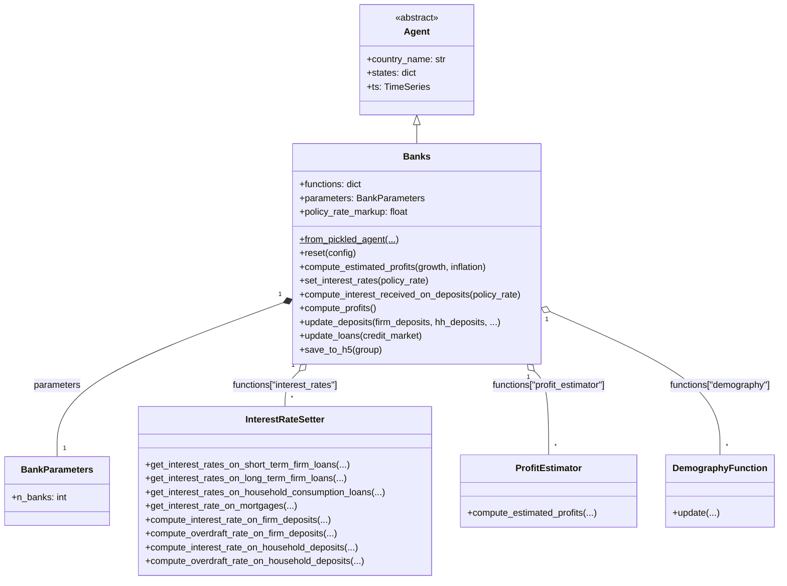
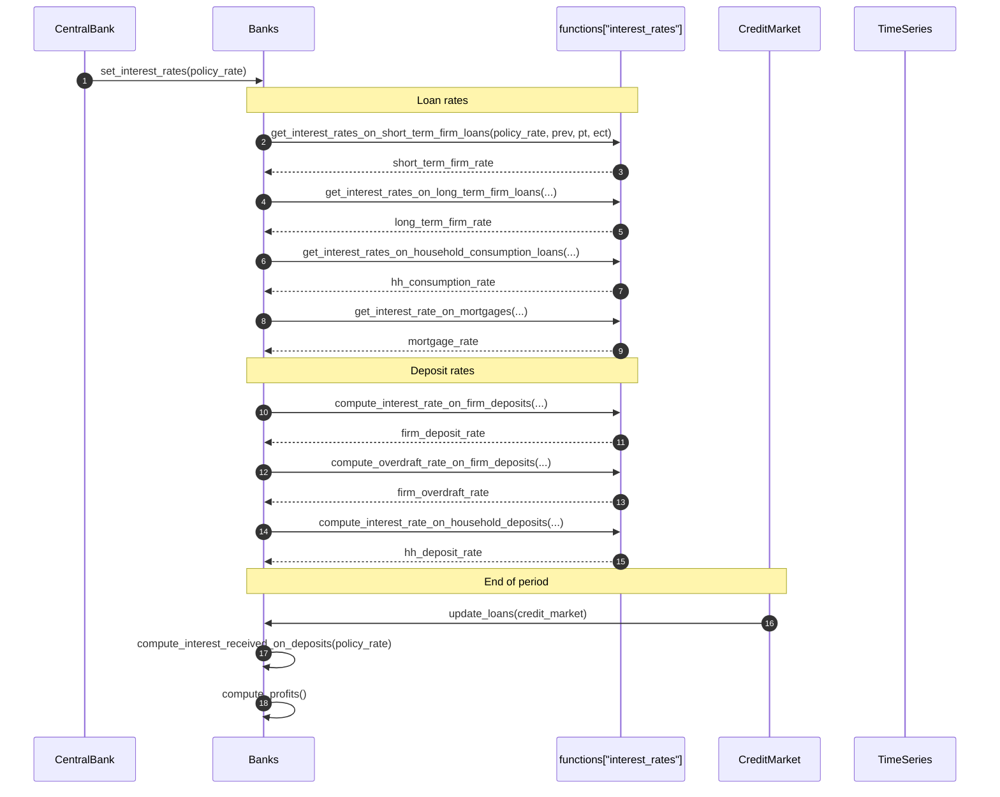
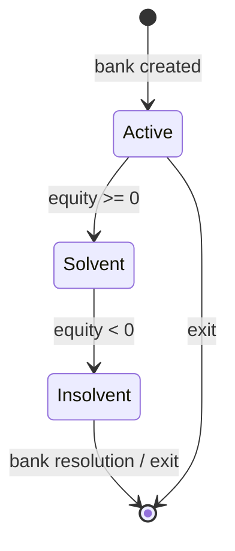
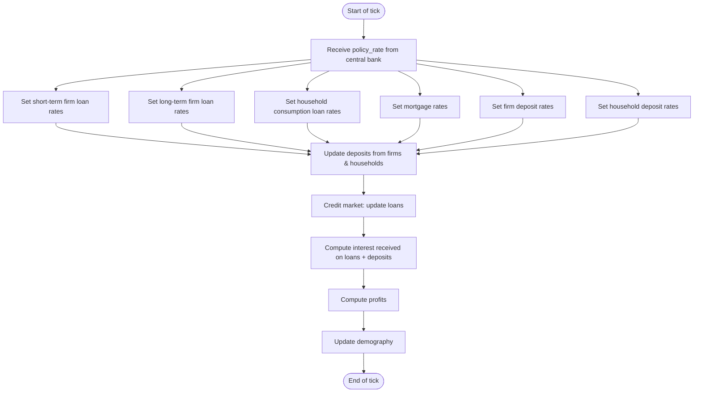

# UML Demo: The `Banks` Agent

This page applies Bersini's four-diagram UML subset to the [`Banks`](../../macromodel/agents/banks/banks.py)
agent — the financial intermediation sector. See the [Individuals UML demo](uml_individual_agent_demo.md) for methodology references.

Reference: Bersini, H. (2012). [*UML for ABM*](https://www.jasss.org/15/1/9.html). JASSS 15(1)9.

---

## 1. Class diagram

`Banks` inherits from `Agent`, holds `BankParameters` and a policy-rate markup,
and aggregates 3 strategy classes: interest-rate setting, profit estimation, and demography.

---

## 2. Sequence diagram

The primary flow: the central bank sets a policy rate, then each bank passes it through
to its loan and deposit rates using error-correction parameters (PT/ECT).

---

## 3. State diagram

A bank has one critical binary state: solvent vs. insolvent.

---

## 4. Activity diagram

One bank tick: receive policy rate → set all product rates → receive deposits → service credit market.

---

*See also:* [Individuals UML demo](uml_individual_agent_demo.md), [Bersini (2012)](https://www.jasss.org/15/1/9.html).
