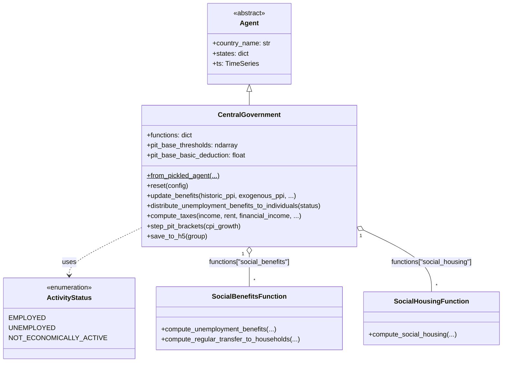
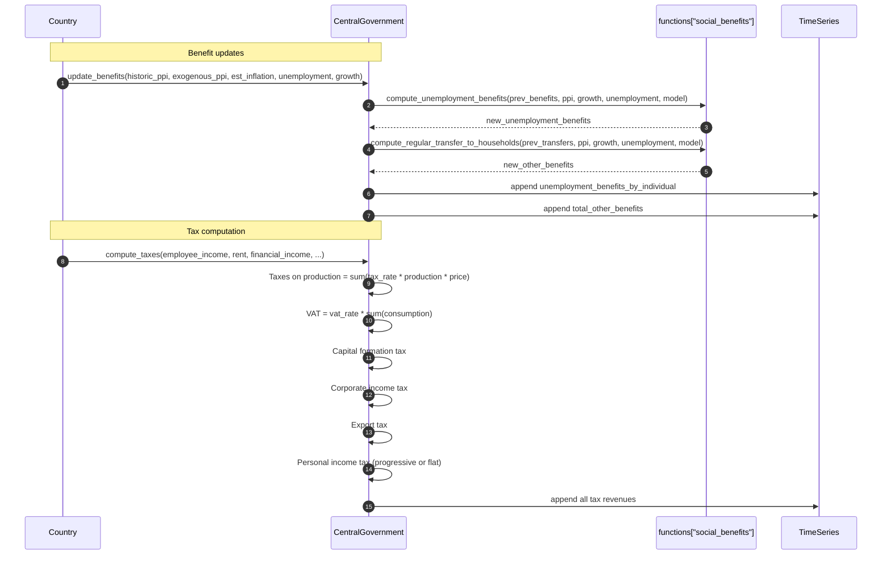
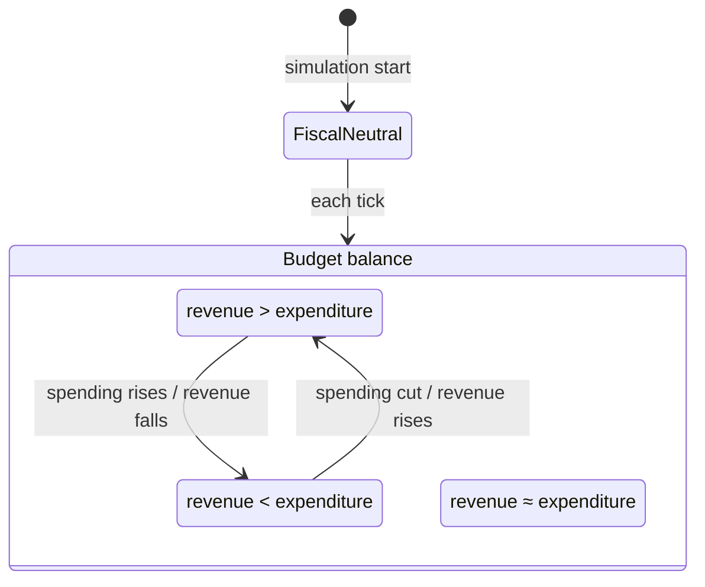
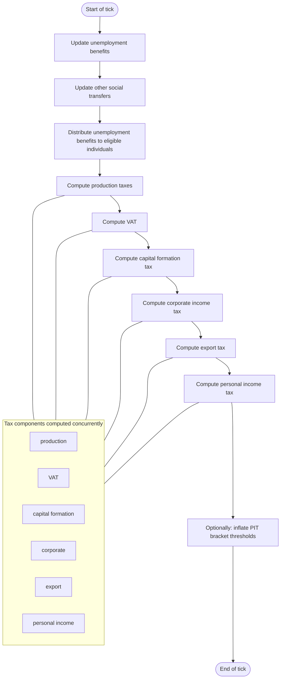

# UML Demo: The `CentralGovernment` Agent

This page applies Bersini's four-diagram UML subset to the [`CentralGovernment`](../../macromodel/agents/central_government/central_government.py)
agent — the fiscal authority. See the [Individuals UML demo](uml_individual_agent_demo.md) for methodology references.

Reference: Bersini, H. (2012). [*UML for ABM*](https://www.jasss.org/15/1/9.html). JASSS 15(1)9.

---

## 1. Class diagram

`CentralGovernment` inherits from `Agent` and aggregates two strategy classes:
`social_benefits` and `social_housing`. It depends on the `ActivityStatus` enum
and the `compute_progressive_tax` function for progressive PIT. It holds an
extensive set of tax rates and benefit models in `states`.

**Key `states` tax instruments:**

| State | Purpose |
|-------|---------|
| `Value-added Tax` | VAT rate |
| `Income Tax` | Flat PIT rate (fallback) |
| `Profit Tax` | Corporate tax rate |
| `Employer Social Insurance Tax` | Employer SI contribution |
| `Employee Social Insurance Tax` | Employee SI deduction |
| `Capital Formation Tax` | Investment tax |
| `Export Tax` | Tax on exports |
| `Taxes Less Subsidies Rates` | Net tax rates by sector |
| `pit_thresholds` | Progressive PIT bracket thresholds |
| `pit_rates` | Progressive PIT marginal rates |
| `pit_basic_deduction` | Non-refundable basic personal amount |
| `unemployment_benefits_model` | Benefit computation model |
| `other_benefits_model` | Social transfer model |

---

## 2. Sequence diagram

Two key flows: updating benefits and computing taxes.

---

## 3. State diagram

The fiscal stance is determined by the budget balance.

---

## 4. Activity diagram

One government tick: update benefits → distribute to individuals → collect taxes.

---

*See also:* [Individuals UML demo](uml_individual_agent_demo.md), [Bersini (2012)](https://www.jasss.org/15/1/9.html).
