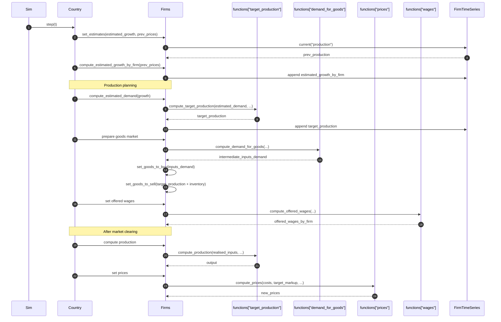
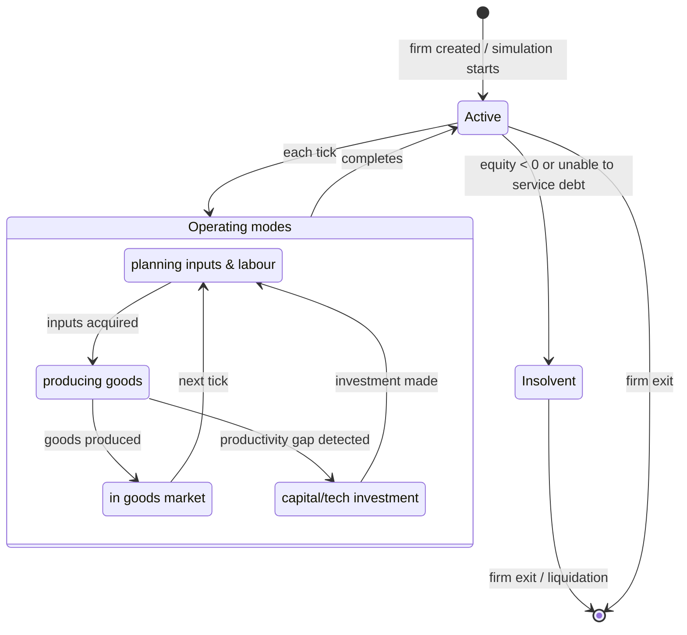
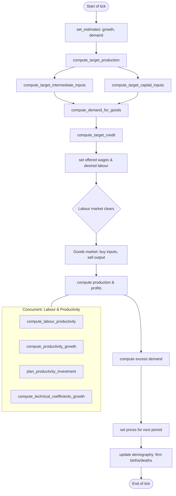

# UML Demo: The `Firms` Agent

This page applies Bersini's four-diagram UML subset to the [`Firms`](../../macromodel/agents/firms/firms.py)
agent — the productive sector of the economy. See the [Individuals UML demo](uml_individual_agent_demo.md) for
methodology references.

Reference: Bersini, H. (2012). [*UML for ABM*](https://www.jasss.org/15/1/9.html). JASSS 15(1)9.

---

## 1. Class diagram

The `Firms` agent inherits from `Agent`, owns a `FirmTimeSeries` (subclass of `TimeSeries`),
and aggregates 21 pluggable strategy classes from
[`macromodel/agents/firms/func/`](../../macromodel/agents/firms/func/). It holds an I/O productivity
table (`base_intermediate_inputs_productivity_matrix`), capital depreciation structure,
and a substitution `bundle_matrix`.

```mermaid
classDiagram
    class Agent {
        <<abstract>>
        +country_name: str
        +states: dict
        +ts: TimeSeries
        +initiate_ts()
        +prepare()
        +set_prices()
        +set_goods_to_buy()
        +set_goods_to_sell()
    }

    class Firms {
        +functions: dict
        +n_industries: int
        +industries: list[str]
        +base_intermediate_inputs_productivity_matrix: ndarray
        +base_capital_inputs_productivity_matrix: ndarray
        +base_capital_inputs_depreciation_matrix: ndarray
        +goods_criticality_matrix: ndarray
        +depreciation_rates: ndarray
        +capital_inputs_delay: ndarray
        +substitution_bundles: ndarray
        +configuration: FirmsConfiguration
        +emission_fractions: EmissionFractions
        +from_pickled_agent(...)$
        +reset(config)
        +update_number_of_firms()
        +set_estimates(growth, prev_prices)
        +compute_estimated_growth_by_firm(...)
        +compute_estimated_demand(growth)
        +get_effective_intermediate_coefficients()
        +get_effective_capital_coefficients()
    }

    class FirmTimeSeries {
        +current(name)
        +historic(name)
        +append(value)
        +n_firms
        +n_firms_by_industry
        +estimated_growth_by_firm
        +estimated_demand
    }

    class FirmsConfiguration {
        +functions
        +parameters
        +substitution_bundles
    }

    class TargetProduction {
        +compute_target_production(...)
    }
    class Production {
        +compute_production(...)
    }
    class DemandEstimator {
        +compute_estimated_demand(...)
    }
    class GrowthEstimator {
        +compute_estimated_growth(...)
    }
    class PriceSetter {
        +set_prices(...)
    }
    class WageSetter {
        +set_wages(...)
    }
    class OfferedWageSetter {
        +set_offered_wages(...)
    }
    class DesiredLabour {
        +compute_desired_labour(...)
    }
    class DemandForGoods {
        +compute_demand_for_goods(...)
    }
    class TargetIntermediateInputs {
        +compute_target_intermediate_inputs(...)
    }
    class TargetCapitalInputs {
        +compute_target_capital_inputs(...)
    }
    class TargetCredit {
        +compute_target_credit(...)
    }
    class ProfitEstimator {
        +compute_estimated_profits(...)
    }
    class LabourProductivity {
        +compute_labour_productivity(...)
    }
    class ProductivityGrowth {
        +compute_productivity_growth(...)
    }
    class ProductivityInvestmentPlanner {
        +plan_productivity_investment(...)
    }
    class TechnicalCoefficientsGrowth {
        +compute_technical_coefficients_growth(...)
    }
    class BoughtGoodsDistributor {
        +distribute_bought_goods(...)
    }
    class ExcessDemand {
        +compute_excess_demand(...)
    }
    class Demography {
        +update(...)
    }

    Agent <|-- Firms
    Firms "1" *-- "1" FirmTimeSeries : owns
    Firms ..> FirmsConfiguration : configured by
    Firms "1" o-- "*" TargetProduction : functions["target_production"]
    Firms "1" o-- "*" Production : functions["production"]
    Firms "1" o-- "*" DemandEstimator : functions["demand_estimator"]
    Firms "1" o-- "*" GrowthEstimator : functions["growth_estimator"]
    Firms "1" o-- "*" PriceSetter : functions["prices"]
    Firms "1" o-- "*" WageSetter : functions["wages"]
    Firms "1" o-- "*" OfferedWageSetter : functions["offered_wages"]
    Firms "1" o-- "*" DesiredLabour : functions["desired_labour"]
    Firms "1" o-- "*" DemandForGoods : functions["demand_for_goods"]
    Firms "1" o-- "*" TargetIntermediateInputs : functions["target_intermediate_inputs"]
    Firms "1" o-- "*" TargetCapitalInputs : functions["target_capital_inputs"]
    Firms "1" o-- "*" TargetCredit : functions["target_credit"]
    Firms "1" o-- "*" ProfitEstimator : functions["profit_estimator"]
    Firms "1" o-- "*" LabourProductivity : functions["labour_productivity"]
    Firms "1" o-- "*" ProductivityGrowth : functions["productivity_growth"]
    Firms "1" o-- "*" ProductivityInvestmentPlanner : functions["productivity_investment_planner"]
    Firms "1" o-- "*" TechnicalCoefficientsGrowth : functions["technical_coefficients_growth"]
    Firms "1" o-- "*" BoughtGoodsDistributor : functions["bought_goods_distributor"]
    Firms "1" o-- "*" ExcessDemand : functions["excess_demand"]
    Firms "1" o-- "*" Demography : functions["demography"]
```

---

## 2. Sequence diagram

Traces one tick from `set_estimates` through to production and goods-market participation.
The firm estimates demand, plans production, acquires intermediate/capital inputs, sets wages,
hires labour, produces, sets prices, and enters goods market clearing.

---

## 3. State diagram

A firm's life-cycle revolves around its solvency status and market position.
Two key state machines exist: insolvency and production planning mode.

---

## 4. Activity diagram

Procedural flow of one firm tick: from estimates through to prices.

---

*See also:* [Individuals UML demo](uml_individual_agent_demo.md), [Bersini (2012)](https://www.jasss.org/15/1/9.html).
