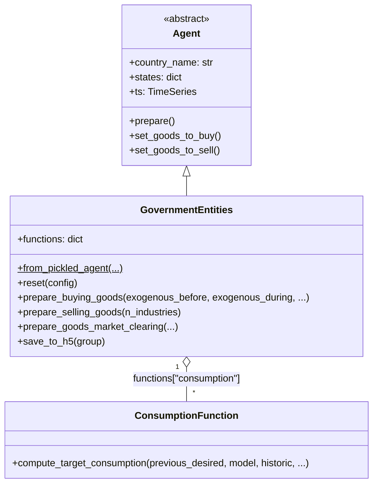
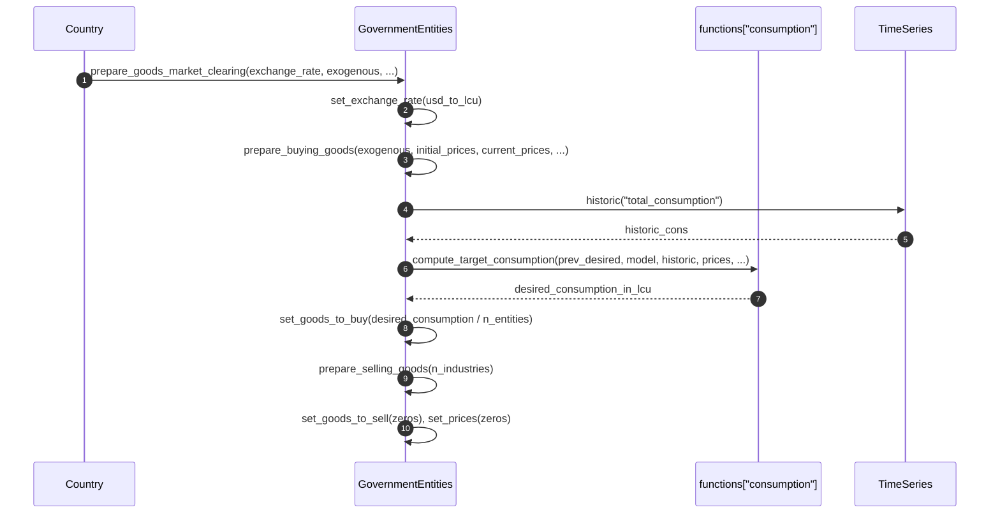
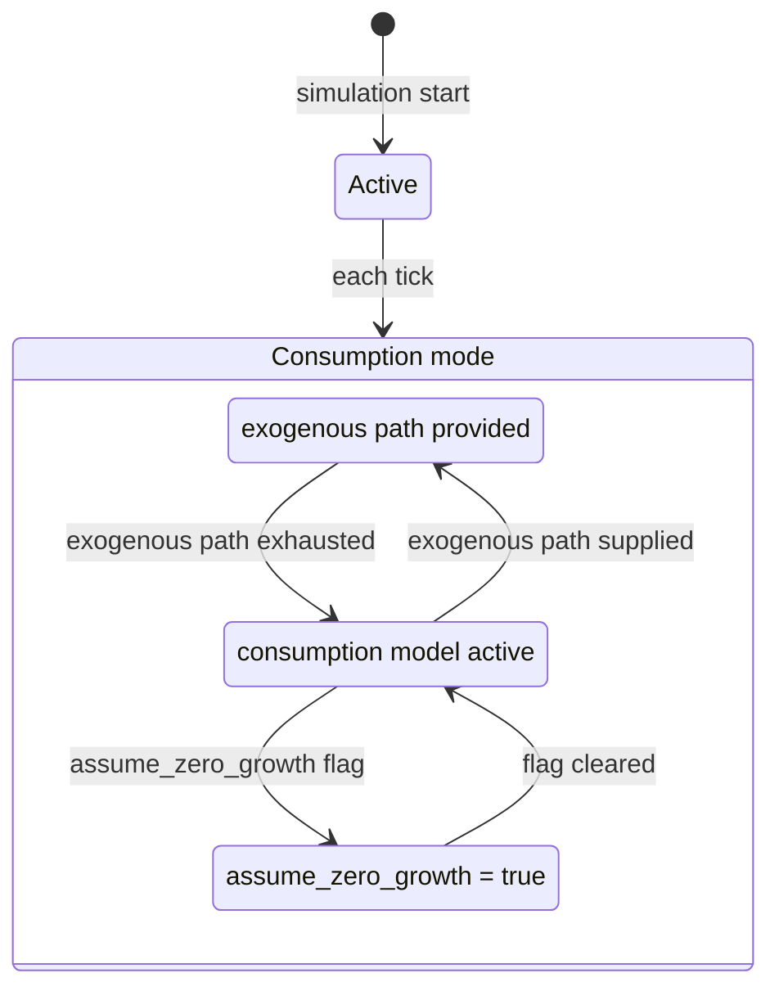

# UML Demo: The `GovernmentEntities` Agent

This page applies Bersini's four-diagram UML subset to the [`GovernmentEntities`](../../macromodel/agents/government_entities/government_entities.py)
agent — government organizations that consume and invest. See the [Individuals UML demo](uml_individual_agent_demo.md)
for methodology references.

Reference: Bersini, H. (2012). [*UML for ABM*](https://www.jasss.org/15/1/9.html). JASSS 15(1)9.

---

## 1. Class diagram

`GovernmentEntities` inherits from `Agent`, aggregates a single `consumption` strategy,
and participates in goods markets as a buyer only (seller side is inactive).



---

## 2. Sequence diagram

A single dominant flow: preparing for goods market clearing.



---

## 3. State diagram

Government entities have no complex lifecycle; their state is captured by exogenous path vs. model-driven consumption.



---

## 4. Activity diagram

```mermaid
flowchart TD
    Start([Start of tick]) --> A[Set exchange rate]
    A --> B{Exogenous consumption?}
    B -- yes --> C[Use exogenous path for historic consumption]
    B -- no --> D[Use time series historic consumption]
    C --> E{Assume zero growth?}
    D --> E
    E -- yes --> F[Use initial consumption as target]
    E -- no --> G[Compute target consumption via model]
    F --> H[Convert to USD and divide across entities]
    G --> H
    H --> I[Set goods_to_buy per entity]
    I --> J[Set goods_to_sell = zeros (buyer only)]
    J --> End([End of tick])
```

---

*See also:* [Central Government UML demo](uml_central_government_agent_demo.md), [Bersini (2012)](https://www.jasss.org/15/1/9.html).
