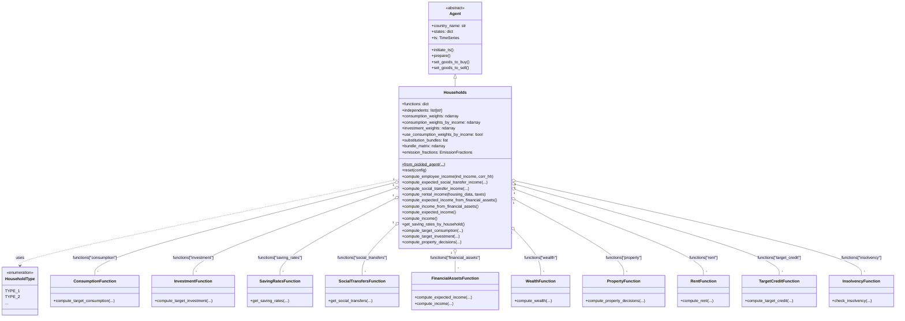
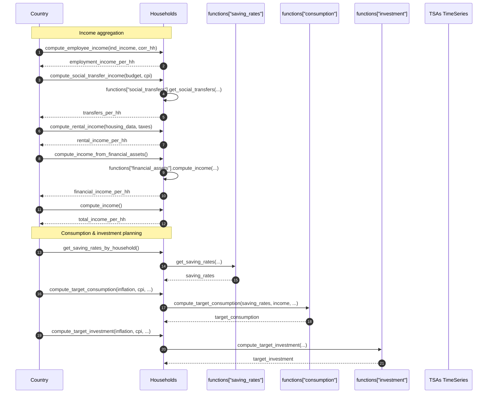
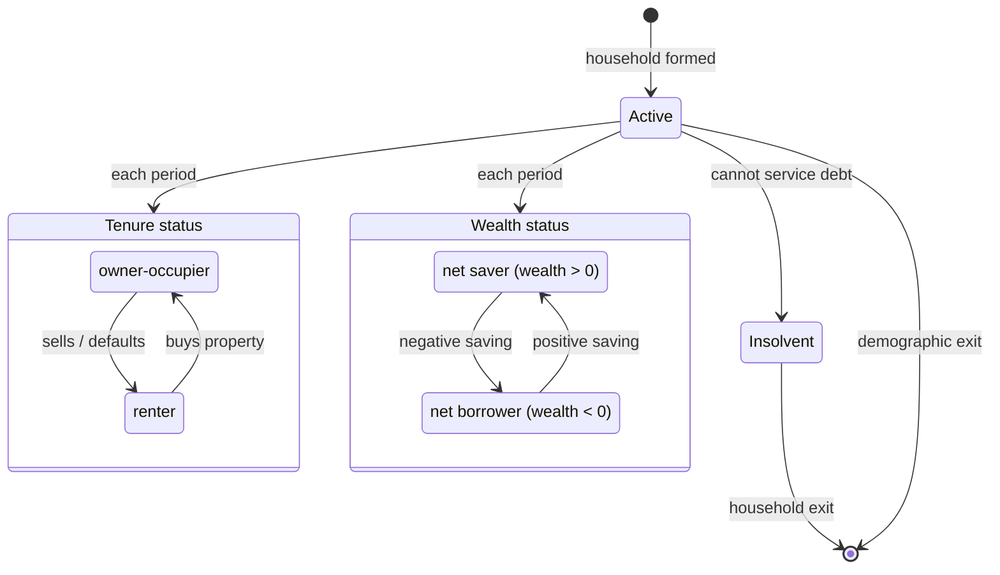
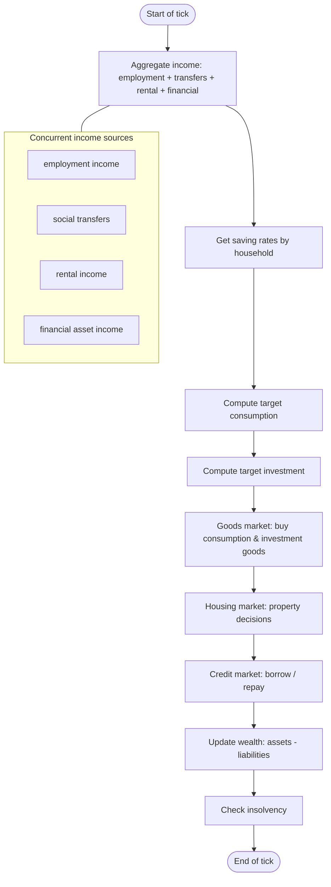

# UML Demo: The `Households` Agent

This page applies Bersini's four-diagram UML subset to the [`Households`](../../macromodel/agents/households/households.py)
agent. See the [Individuals UML demo](uml_individual_agent_demo.md) for methodology references.

Reference: Bersini, H. (2012). [*UML for ABM*](https://www.jasss.org/15/1/9.html). JASSS 15(1)9.

---

## 1. Class diagram

The `Households` agent inherits from `Agent`, holds consumption/investment weight matrices,
and aggregates 10 strategy classes. It also depends on the `HouseholdType` enum and the
`Banks` agent for credit-market interactions.

---

## 2. Sequence diagram

Two key flows: income aggregation (from the four income sources) and consumption planning.

---

## 3. State diagram

Household economic states revolve around tenure (owner/renter), wealth, and solvency.

---

## 4. Activity diagram

One household tick: income → saving → consumption → investment → wealth update.

---

*See also:* [Individuals UML demo](uml_individual_agent_demo.md), [Firms UML demo](uml_firms_agent_demo.md), [Bersini (2012)](https://www.jasss.org/15/1/9.html).
