# UML Demo: Agent Diagrams

This page applies UML to the agents in this repository, following the
four-diagram subset advocated by Bersini (2012),
[*UML for ABM*, JASSS 15(1)9](https://www.jasss.org/15/1/9.html):

1. **Class diagram** — static structure (what the agent *is*, what it is *related to*).
2. **Sequence diagram** — interactions over time (who calls whom, in what order).
3. **State diagram** — the agent's life-cycle.
4. **Activity diagram** — the procedural flow of one tick.

We start with a small, fully-worked example on the [`Individuals`](../../macromodel/agents/individuals/individuals.py)
agent, then cover each of the other agent types more compactly. As Bersini
notes, *"draw as much of the diagram as is needed to help your programming,
but no more"*.

All diagrams below are written in [Mermaid](https://mermaid.js.org/), so they
render in GitHub, in MkDocs Material, and in most modern Markdown previewers.

## 0. Agent hierarchy overview

A single class diagram of how every agent in
[`macromodel/agents/`](../../macromodel/agents/) relates to the abstract base
`Agent`. This is the entry-point map for the rest of the page.

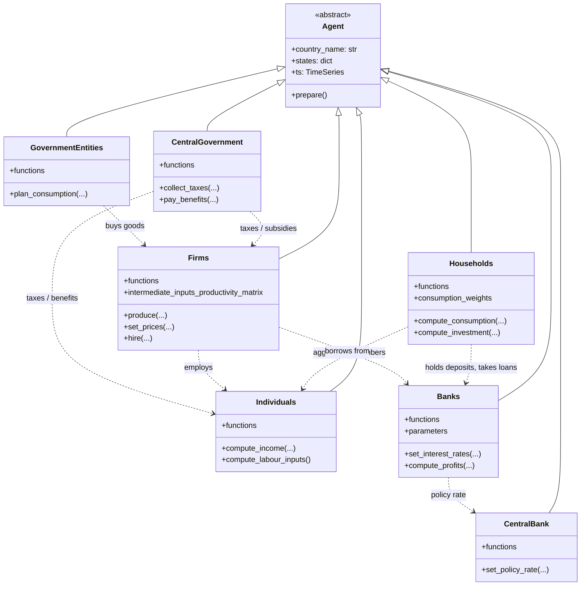

---

# Part A — Worked example: `Individuals`

---

## 1. Class diagram

The class diagram shows the structural skeleton: the `Individuals` agent
inherits from the abstract base `Agent`, holds a `TimeSeries`, references
`IndividualsConfiguration`, and aggregates a set of pluggable *behaviour*
classes (the "function" objects under
[`macromodel/agents/individuals/func/`](../../macromodel/agents/individuals/func/)).

This mirrors Bersini's Figure 2 pattern — keep agents and their behaviours in
separate classes so behaviours can be swapped without touching the agent.

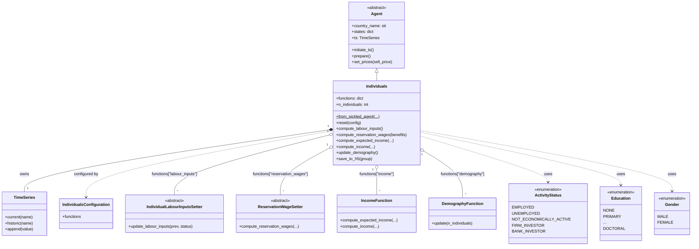

**Reading notes (following Bersini §2.1–2.11):**

- The **filled diamond** between `Individuals` and `TimeSeries` is *composition*:
  the time series dies with its owning agent.
- The **open diamonds** to the behaviour classes are *aggregation*: the strategy
  objects are injected from configuration and can be swapped.
- The **dashed arrows** to the enums are *dependency*: enums appear only as
  values inside `states`, not as owned objects.
- `Agent` is *abstract* (italic in UML convention); no plain `Agent` is ever
  instantiated.

---

## 2. Sequence diagram

A single simulation tick triggers many interactions. The sequence diagram
focuses on **one slice**: how an individual's income for the current period is
computed. This is the most common scenario one would want to trace when
debugging or onboarding.

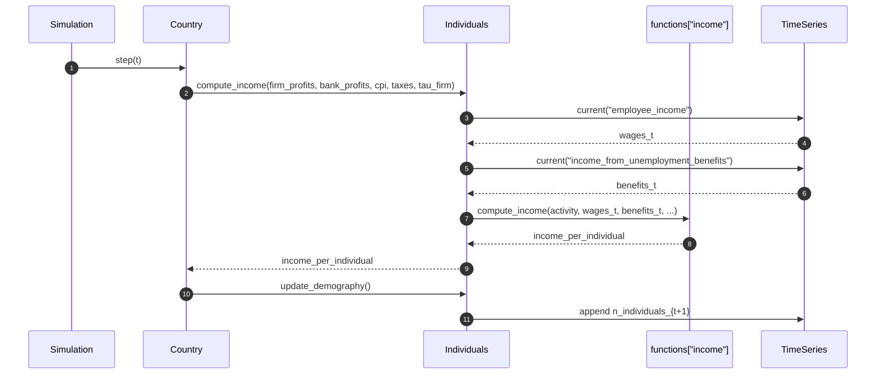

A second slice — labour-market participation — is short enough to share the
same diagram style:

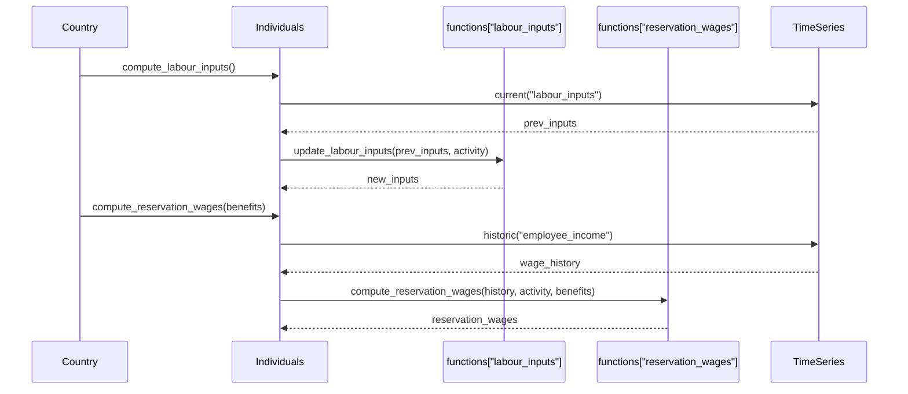

Per Bersini §2.13–2.16, we keep the diagram deliberately shallow: no nested
`loop`/`alt` frames. The goal is to make the *responsibilities* visible, not to
reproduce the source code.

---

## 3. State diagram

The most useful state machine for an individual in this model is their
**activity status** life-cycle. It comes straight from the
[`ActivityStatus`](../../macromodel/agents/individuals/individual_properties.py)
enum, and transitions are driven by labour-market matching, retirement /
demographic updates, and investment events.

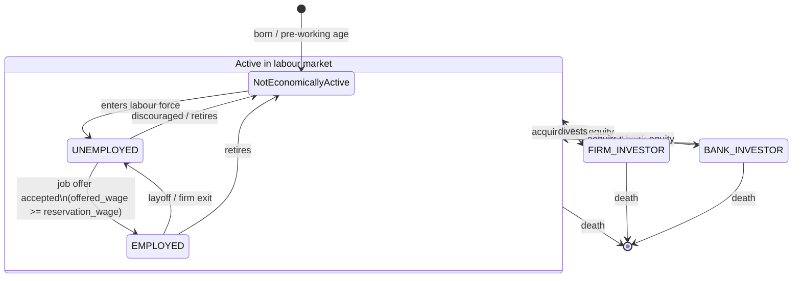

**Notes (Bersini §2.17–2.19):**

- The composite state `Active in labour market` lets us draw the *death*
  transition once, rather than from every leaf state.
- Guards on the `UNEMPLOYED → EMPLOYED` transition correspond to the
  `Started New Job` / `Offered Wage of Accepted Job` flags that the model
  already tracks in `states`.

---

## 4. Activity diagram

Finally, the activity diagram captures the *procedural* flow of what
`Individuals` does within one simulation step. This is the diagram to draw
when you want to explain "what happens in a tick" without showing call sites.

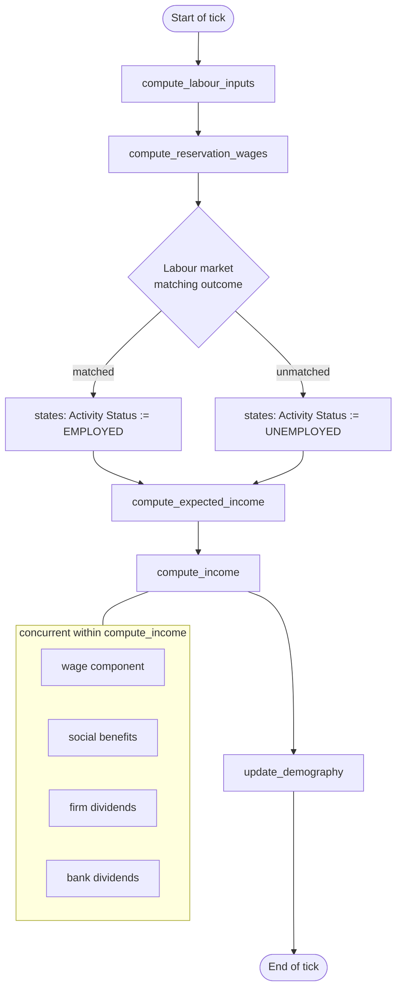

The forked block inside `compute_income` is the Bersini "concurrent activities"
construct (§2.21) — these income components are computed jointly per
individual and summed.

---

# Part B — Other agent types

For each of the remaining agents we show two diagrams: a **class diagram**
(structure and behaviour strategies) and an **activity diagram** (what the
agent does in one tick). State diagrams are added only where the agent has a
non-trivial state machine; the same goes for sequence diagrams.

## 5. `Firms`

[`Firms`](../../macromodel/agents/firms/firms.py) is by far the
behaviour-richest agent — production, pricing, hiring, investment, credit,
emissions. The class diagram emphasises the strategy injection pattern in
[`firms/func/`](../../macromodel/agents/firms/func/).

### Class diagram

```mermaid
classDiagram
    class Agent {
        <<abstract>>
    }

    class Firms {
        +functions: dict
        +configuration: FirmsConfiguration
        +intermediate_inputs_productivity_matrix
        +capital_inputs_productivity_matrix
        +capital_inputs_depreciation_matrix
        +goods_criticality_matrix
        +depreciation_rates
        +average_initial_price
        +industries: list~str~
        +bundle_matrix
        +emission_fractions
    }

    class FirmTimeSeries
    class FirmsConfiguration
    class CreditMarket
    class EmissionFractions

    class TargetProduction { <<strategy>> }
    class TargetIntermediateInputs { <<strategy>> }
    class TargetCapitalInputs { <<strategy>> }
    class DesiredLabour { <<strategy>> }
    class Production { <<strategy>> }
    class Prices { <<strategy>> }
    class WageSetter { <<strategy>> }
    class OfferedWageSetter { <<strategy>> }
    class TargetCredit { <<strategy>> }
    class ProductivityInvestmentPlanner { <<strategy>> }
    class ProductivityGrowth { <<strategy>> }
    class DemandEstimator { <<strategy>> }
    class GrowthEstimator { <<strategy>> }
    class ProfitEstimator { <<strategy>> }
    class ExcessDemand { <<strategy>> }
    class BoughtGoodsDistributor { <<strategy>> }
    class Demography { <<strategy>> }

    Agent <|-- Firms
    Firms "1" *-- "1" FirmTimeSeries
    Firms ..> FirmsConfiguration
    Firms ..> CreditMarket
    Firms ..> EmissionFractions
    Firms "1" o-- "*" TargetProduction
    Firms "1" o-- "*" TargetIntermediateInputs
    Firms "1" o-- "*" TargetCapitalInputs
    Firms "1" o-- "*" DesiredLabour
    Firms "1" o-- "*" Production
    Firms "1" o-- "*" Prices
    Firms "1" o-- "*" WageSetter
    Firms "1" o-- "*" OfferedWageSetter
    Firms "1" o-- "*" TargetCredit
    Firms "1" o-- "*" ProductivityInvestmentPlanner
    Firms "1" o-- "*" ProductivityGrowth
    Firms "1" o-- "*" DemandEstimator
    Firms "1" o-- "*" GrowthEstimator
    Firms "1" o-- "*" ProfitEstimator
    Firms "1" o-- "*" ExcessDemand
    Firms "1" o-- "*" BoughtGoodsDistributor
    Firms "1" o-- "*" Demography
```

### State diagram

A firm's solvency status drives its life cycle.

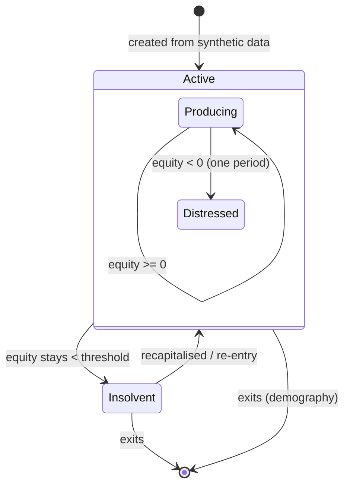

### Activity diagram (one tick)

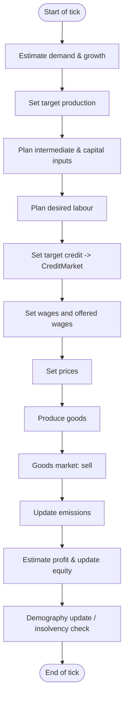

---

## 6. `Households`

[`Households`](../../macromodel/agents/households/households.py) handles
consumption, investment, savings, housing, and credit. It is parameterised by
consumption / investment weights and uses a `HouseholdType` enum from
[`household_properties.py`](../../macromodel/agents/households/household_properties.py).

### Class diagram

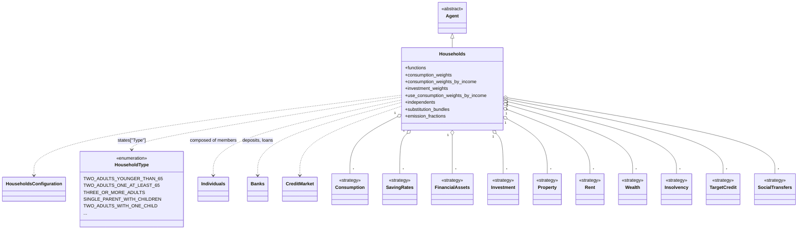

### Activity diagram (one tick)

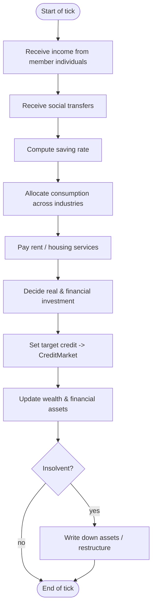

---

## 7. `Banks`

[`Banks`](../../macromodel/agents/banks/banks.py) intermediate deposits and
loans, set rates as a markup over the central bank's policy rate, and may
become insolvent.

### Class diagram

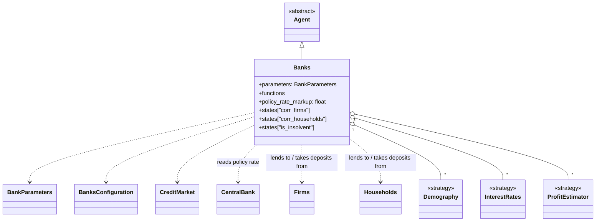

### State diagram

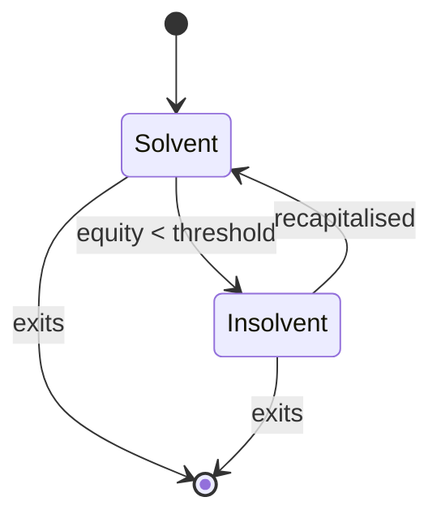

### Activity diagram (one tick)

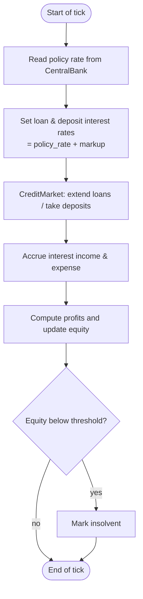

---

## 8. `CentralBank`

[`CentralBank`](../../macromodel/agents/central_bank/central_bank.py)
implements a Taylor-style monetary policy rule.

### Class diagram

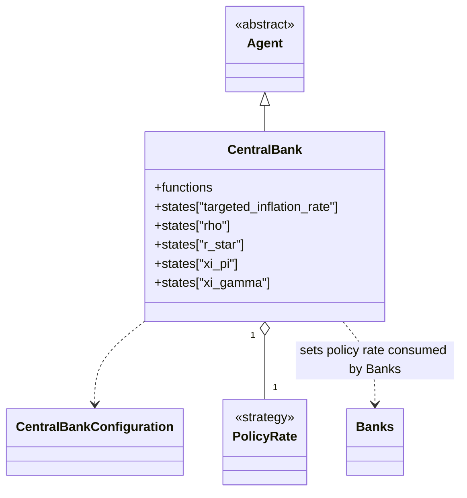

### Activity diagram (one tick)

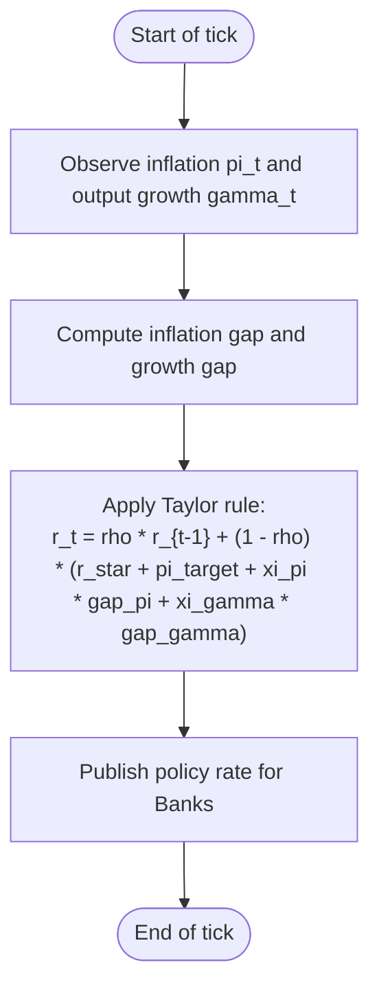

---

## 9. `CentralGovernment`

[`CentralGovernment`](../../macromodel/agents/central_government/central_government.py)
collects taxes (including a progressive PIT) and pays social benefits.

### Class diagram

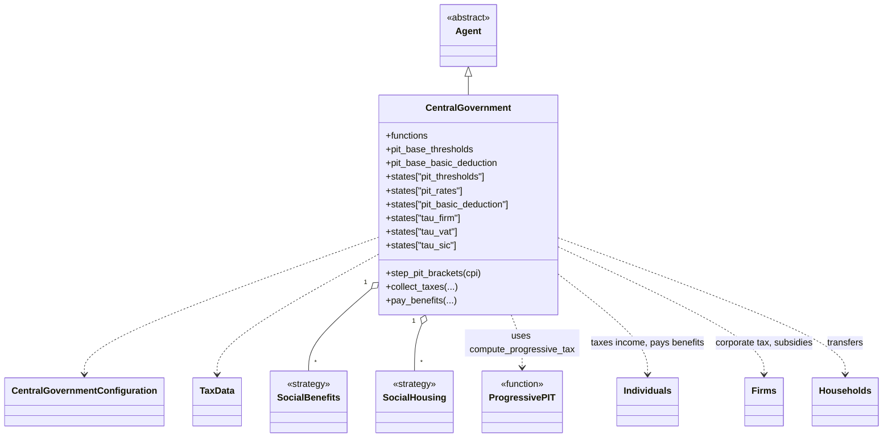

### Activity diagram (one tick)

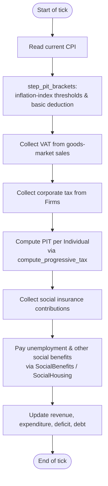

---

## 10. `GovernmentEntities`

[`GovernmentEntities`](../../macromodel/agents/government_entities/government_entities.py)
models the public sector as a goods-market buyer (government consumption and
investment).

### Class diagram

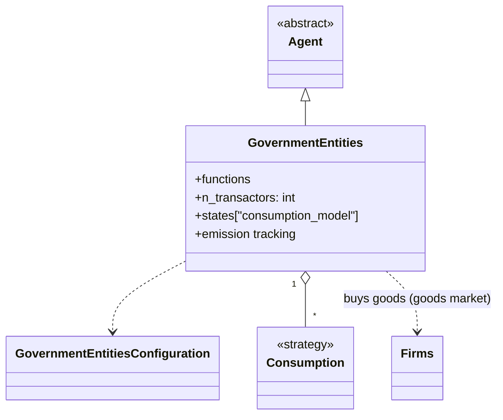

### Activity diagram (one tick)

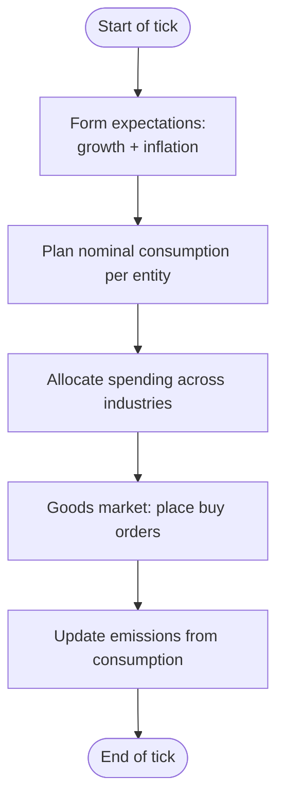

---

## Why these four diagrams?

Bersini's central argument is that **UML pays off as model complexity grows**.
We picked the four diagrams (class, sequence, state, activity) that have the
highest signal-to-effort ratio for ABM work, and added the simplest cuts that
match each agent: every agent gets a class + activity diagram; we add a state
diagram only where the agent really has a state machine (`Individuals`,
`Firms`, `Banks`) and a sequence diagram only where the call flow benefits
from being traced (`Individuals`).

If a follow-up is needed, natural extensions are:

- A sequence diagram of one **goods-market clearing** round across
  `Firms`, `Households`, and `GovernmentEntities`.
- A sequence diagram of one **credit-market round** across `Firms`,
  `Households`, and `Banks`.
- An activity diagram of one **full `Simulation.step()`**.

## Reference

Bersini, H. (2012). *UML for ABM*. Journal of Artificial Societies and Social
Simulation 15 (1) 9. <https://www.jasss.org/15/1/9.html>
