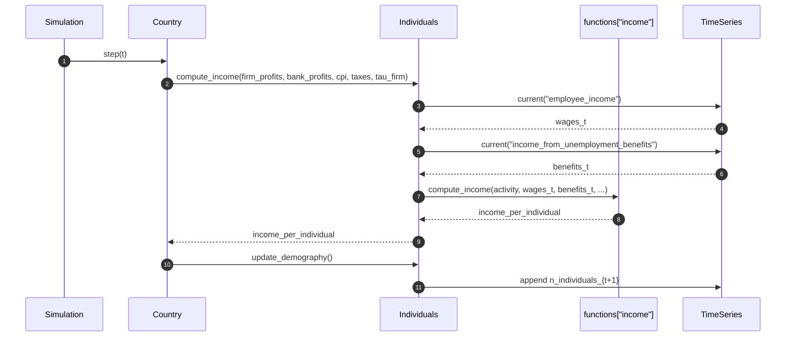
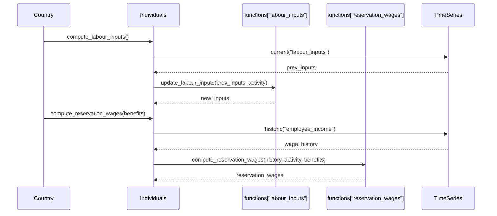
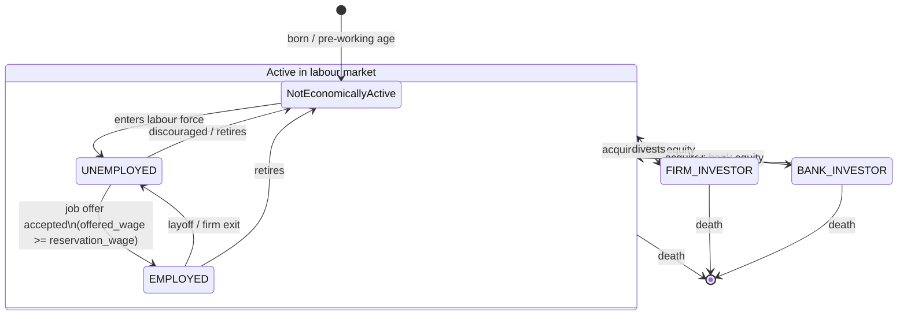

# UML Demo: The `Individuals` Agent

This page is a small worked example of applying UML to one agent in this
repository, following the four-diagram subset advocated by Bersini (2012),
[*UML for ABM*, JASSS 15(1)9](https://www.jasss.org/15/1/9.html):

1. **Class diagram** — static structure (what the agent *is*, what it is *related to*).
2. **Sequence diagram** — interactions over time (who calls whom, in what order).
3. **State diagram** — the agent's life-cycle (labour-market states and transitions).
4. **Activity diagram** — the procedural flow of one tick for one individual.

We deliberately scope the demo to a single agent class — [`Individuals`](../../macromodel/agents/individuals/individuals.py)
— rather than the whole model. As Bersini notes, *"draw as much of the diagram
as is needed to help your programming, but no more"*.

All diagrams below are written in [Mermaid](https://mermaid.js.org/), so they
render in GitHub, in MkDocs Material, and in most modern Markdown previewers.

---

## 1. Class diagram

The class diagram shows the structural skeleton: the `Individuals` agent
inherits from the abstract base `Agent`, holds a `TimeSeries`, references
`IndividualsConfiguration`, and aggregates a set of pluggable *behaviour*
classes (the "function" objects under
[`macromodel/agents/individuals/func/`](../../macromodel/agents/individuals/func/)).

This mirrors Bersini's Figure 2 pattern — keep agents and their behaviours in
separate classes so behaviours can be swapped without touching the agent.

**Reading notes (following Bersini §2.1–2.11):**

- The **filled diamond** between `Individuals` and `TimeSeries` is *composition*:
  the time series dies with its owning agent.
- The **open diamonds** to the behaviour classes are *aggregation*: the strategy
  objects are injected from configuration and can be swapped.
- The **dashed arrows** to the enums are *dependency*: enums appear only as
  values inside `states`, not as owned objects.
- `Agent` is *abstract* (italic in UML convention); no plain `Agent` is ever
  instantiated.

---

## 2. Sequence diagram

A single simulation tick triggers many interactions. The sequence diagram
focuses on **one slice**: how an individual's income for the current period is
computed. This is the most common scenario one would want to trace when
debugging or onboarding.

A second slice — labour-market participation — is short enough to share the
same diagram style:

Per Bersini §2.13–2.16, we keep the diagram deliberately shallow: no nested
`loop`/`alt` frames. The goal is to make the *responsibilities* visible, not to
reproduce the source code.

---

## 3. State diagram

The most useful state machine for an individual in this model is their
**activity status** life-cycle. It comes straight from the
[`ActivityStatus`](../../macromodel/agents/individuals/individual_properties.py)
enum, and transitions are driven by labour-market matching, retirement /
demographic updates, and investment events.

**Notes (Bersini §2.17–2.19):**

- The composite state `Active in labour market` lets us draw the *death*
  transition once, rather than from every leaf state.
- Guards on the `UNEMPLOYED → EMPLOYED` transition correspond to the
  `Started New Job` / `Offered Wage of Accepted Job` flags that the model
  already tracks in `states`.

---

## 4. Activity diagram

Finally, the activity diagram captures the *procedural* flow of what
`Individuals` does within one simulation step. This is the diagram to draw
when you want to explain "what happens in a tick" without showing call sites.

The forked block inside `compute_income` is the Bersini "concurrent activities"
construct (§2.21) — these income components are computed jointly per
individual and summed.

---

## Why these four, and why this agent?

Bersini's central argument is that **UML pays off as model complexity grows**.
This repository already has many agent types (`Firms`, `Households`, `Banks`,
…). Drawing all of them at once would either be too shallow to be useful or
too dense to read.

Starting with **one agent (`Individuals`)** keeps the demo small enough to
hand-draw, while still illustrating each of the four diagram types with real
classes, real methods, and real state names from the codebase.

If this demo proves useful, natural follow-ups are:

- A class diagram of the **agent hierarchy** under `macromodel/agents/`.
- A sequence diagram of one **goods-market clearing** round, showing
  `Firms ↔ Market ↔ Households`.
- An activity diagram of one **full `Simulation.step()`**.

## Reference

Bersini, H. (2012). *UML for ABM*. Journal of Artificial Societies and Social
Simulation 15 (1) 9. <https://www.jasss.org/15/1/9.html>
