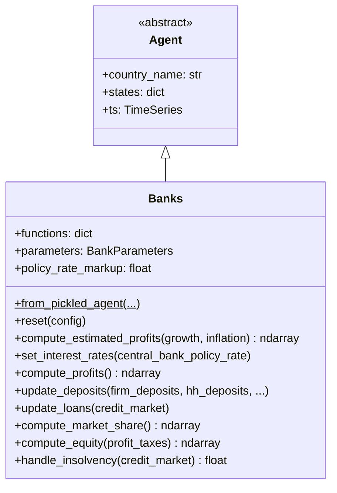

# UML: Banks Agent — Progressive PIT Update

This page documents the `Banks` agent in the progressive PIT branch.

**PIT impact**: 🟢 **Unchanged.** Banks intermediate deposits and loans, set interest
rates, and compute profits. They pay corporate tax at the flat `Profit Tax` rate and
are unaffected by changes to personal income taxation.

---

## 1. Class diagram

---

## 2. PIT-related observations

| Aspect | Detail |
|--------|--------|
| **Bank profits** | Taxed at flat `Profit Tax` (corporate) — not PIT |
| **Interest rate setting** | Responds to `CentralBank.policy_rate` — unchanged |
| **Deposit/loan management** | No tax awareness — unchanged |
| **Equity computation** | Uses `profit_taxes` (corporate rate) — unchanged |

> Banks are completely unaffected by the PIT update. Their tax obligation is corporate
> (`Profit Tax`), not personal income tax.
