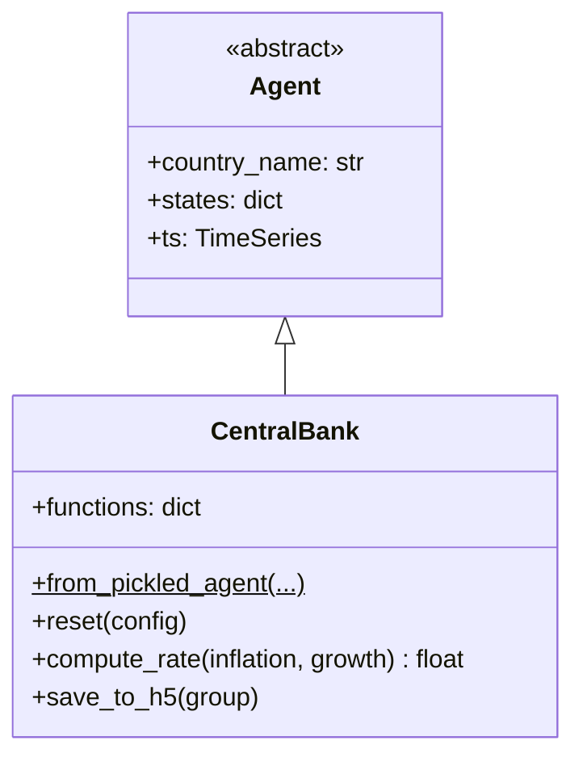

# UML: CentralBank Agent — Progressive PIT Update

This page documents the `CentralBank` agent in the progressive PIT branch.

**PIT impact**: 🟢 **Unchanged.** The CentralBank implements monetary policy via a
Taylor-type rule responding to inflation and output gaps. It has no interaction with
personal income tax.

---

## 1. Class diagram

**Key monetary policy parameters (`states`):**

| State | Type | Purpose |
|-------|------|---------|
| `targeted_inflation_rate` | float | Inflation target |
| `rho` | float | Interest rate smoothing |
| `r_star` | float | Natural real interest rate |
| `xi_pi` | float | Inflation gap response |
| `xi_gamma` | float | Output growth response |

---

## 2. PIT-related observations

The CentralBank is completely decoupled from tax policy. It operates on:

- Inflation gap → `xi_pi * (inflation - targeted_inflation_rate)`
- Output gap → `xi_gamma * growth`
- Smoothing → `rho * prev_rate`

None of these inputs involve tax rates. The PIT update has zero impact on monetary policy.
