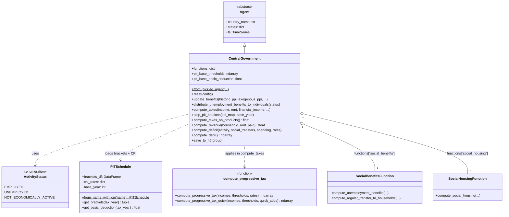
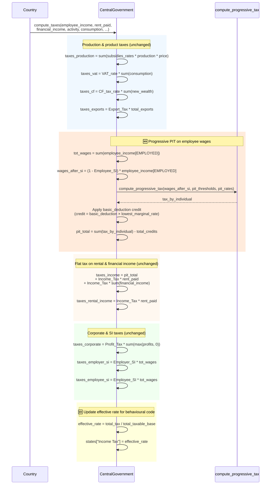
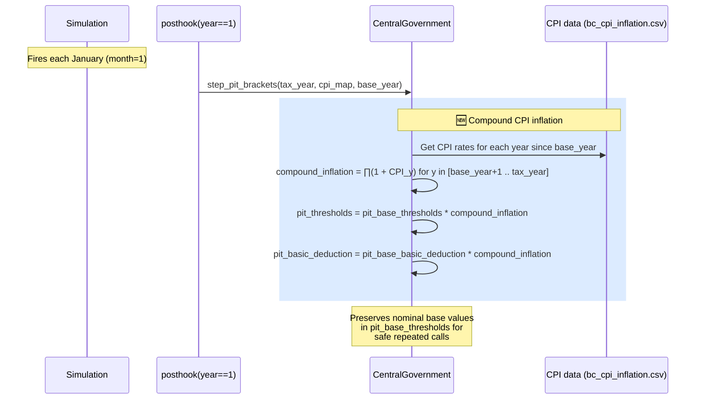
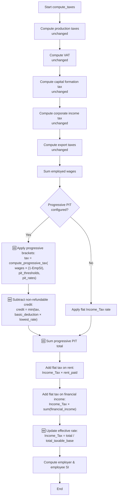
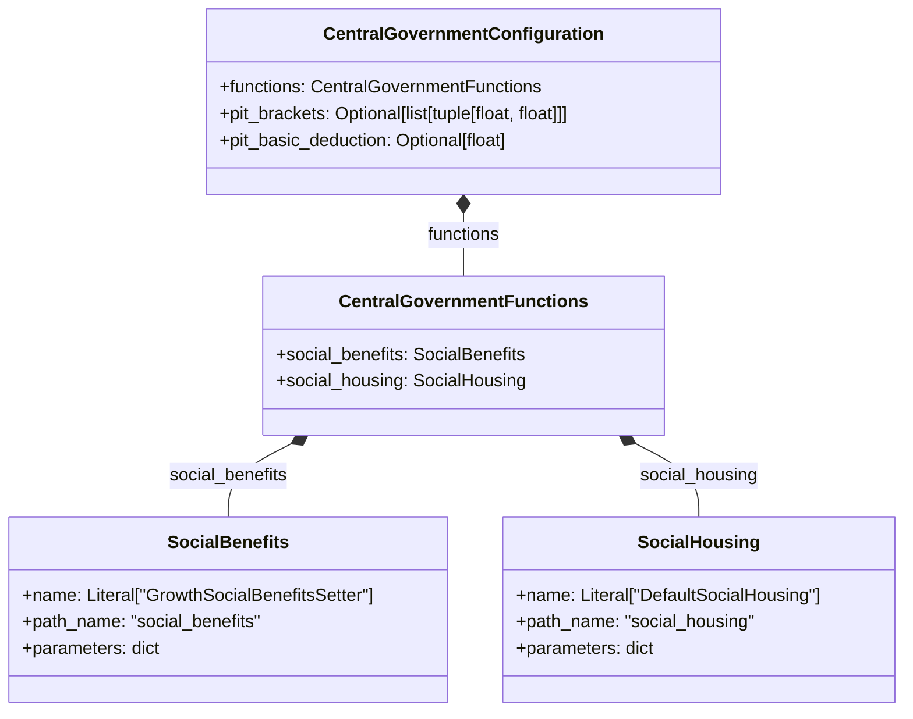
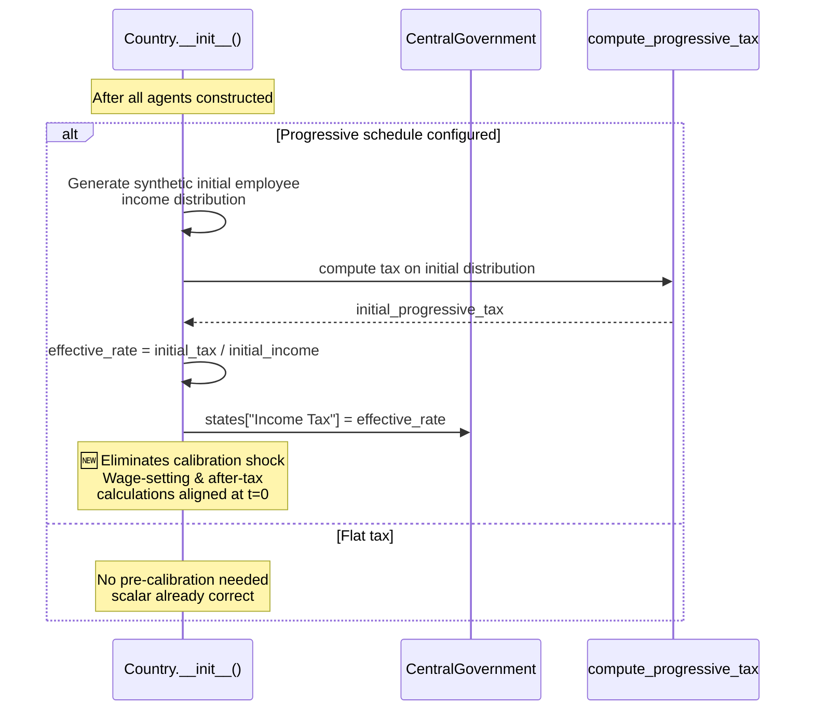

# UML: CentralGovernment Agent — Progressive PIT Update

This page documents the `CentralGovernment` agent **after** the progressive Personal Income
Tax (PIT) update. Compare with the [upstream flat-tax design](../upstream_model/uml_central_government.md).

**Key changes from upstream**:
- ✅ Progressive multi-bracket tax schedule on employee wages
- ✅ CPI indexation of brackets via `step_pit_brackets()`
- ✅ Non-refundable basic personal amount (deduction × lowest marginal rate)
- ✅ Dual tax rate tracking: scalar `Income Tax` (effective rate) + `pit_thresholds`/`pit_rates`
- ✅ Pre-calibration at t=0 in `Country` to eliminate calibration shock
- ✅ New `pit_basic_deduction` and `pit_base_thresholds` snapshot fields

Reference: Bersini, H. (2012). [*UML for ABM*](https://www.jasss.org/15/1/9.html). JASSS 15(1)9.

---

## 1. Class diagram — changes highlighted

**`states` — progressive PIT additions highlighted 🆕:**

| State | Type | Purpose | Status |
|-------|------|---------|--------|
| `Value-added Tax` | float | VAT rate | unchanged |
| `Income Tax` | float | **Effective** flat rate (updated each period) | modified |
| `pit_thresholds` 🆕 | ndarray | Progressive bracket thresholds (CPI-indexed) | NEW |
| `pit_rates` 🆕 | ndarray | Marginal rates per bracket | NEW |
| `pit_basic_deduction` 🆕 | float | Non-refundable basic personal amount (CPI-indexed) | NEW |
| `Profit Tax` | float | Corporate tax rate | unchanged |
| `Employer Social Insurance Tax` | float | Employer SI | unchanged |
| `Employee Social Insurance Tax` | float | Employee SI | unchanged |
| `Capital Formation Tax` | float | Investment tax | unchanged |
| `Export Tax` | float | Export tax | unchanged |
| `Taxes Less Subsidies Rates` | ndarray | Net tax rates by sector | unchanged |
| `unemployment_benefits_model` | object | Benefit model | unchanged |
| `other_benefits_model` | object | Transfer model | unchanged |

---

## 2. Sequence diagram — `compute_taxes()` with progressive PIT

---

## 3. Sequence diagram — annual CPI bracket indexation

---

## 4. Activity diagram — tax computation with progressive PIT

---

## 5. Configuration class — with PIT fields 🆕

| Field | Type | Default | Purpose |
|-------|------|---------|---------|
| `pit_brackets` 🆕 | `Optional[list[tuple[float, float]]]` | `None` | List of (upper_bound, marginal_rate) tuples. `None` = flat tax fallback |
| `pit_basic_deduction` 🆕 | `Optional[float]` | `None` | Non-refundable basic personal amount |

---

## 6. Pre-calibration at t=0 (in `Country`)

