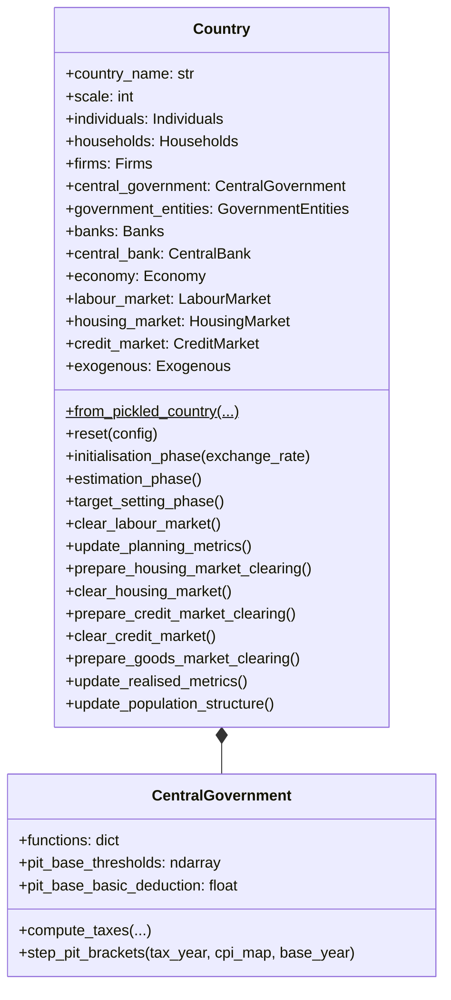
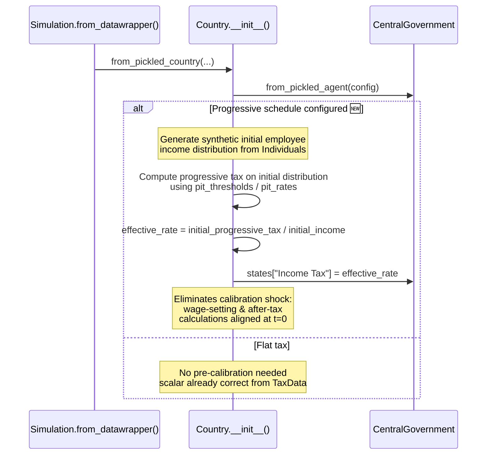

# UML: Country Orchestrator — Progressive PIT Update

This page documents the `Country` class in the progressive PIT branch.

**PIT impact**: 🟡 **Modified.** The `Country.__init__()` now includes a **pre-calibration step**
at t=0 that computes the effective tax rate from the initial income distribution when a
progressive PIT schedule is configured. This eliminates a calibration shock at simulation start.

---

## 1. Class diagram

---

## 2. PIT change: Pre-calibration at t=0 🆕

**Why this matters**: Without pre-calibration, the scalar `Income Tax` (e.g., 20% flat)
would be used for wage-setting while progressive brackets compute actual tax. This mismatch
would cause a one-time shock at t=0. Pre-calibration computes the effective rate that the
progressive schedule would produce on the initial income distribution, and writes that back
into the scalar.
