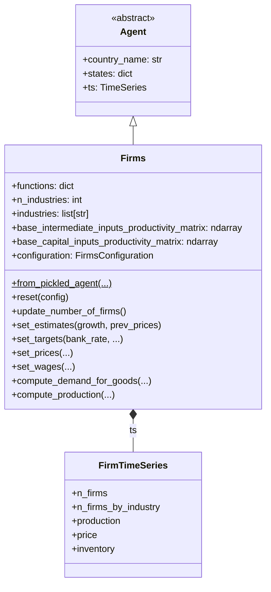

# UML: Firms Agent — Progressive PIT Update

This page documents the `Firms` agent in the progressive PIT branch.

**PIT impact**: 🟢 **Unchanged.** Firms continue to produce goods, set prices, hire
workers, and pay corporate taxes at the flat `Profit Tax` rate. The PIT update only
affects personal income taxation on the government side.

---

## 1. Class diagram

---

## 2. PIT-related observations

| Aspect | Detail |
|--------|--------|
| **Corporate tax** | Flat `Profit Tax` — unchanged |
| **Wage setting** | Uses scalar `Income Tax` rate for after-tax wage calculations — unchanged mechanism; the scalar is updated to the effective rate each period |
| **Employer SI** | Flat `Employer Social Insurance Tax` — unchanged |
| **Employee SI** | Flat `Employee Social Insurance Tax` — passed to `CentralGovernment` — unchanged |
| **Production decisions** | No tax awareness — unchanged |

> **Key design invariant**: Wage-setting functions use `states["Income Tax"]` which is
> updated to the effective rate after progressive calculation. This ensures wages adjust
> to the overall tax burden without needing to know the bracket structure.
