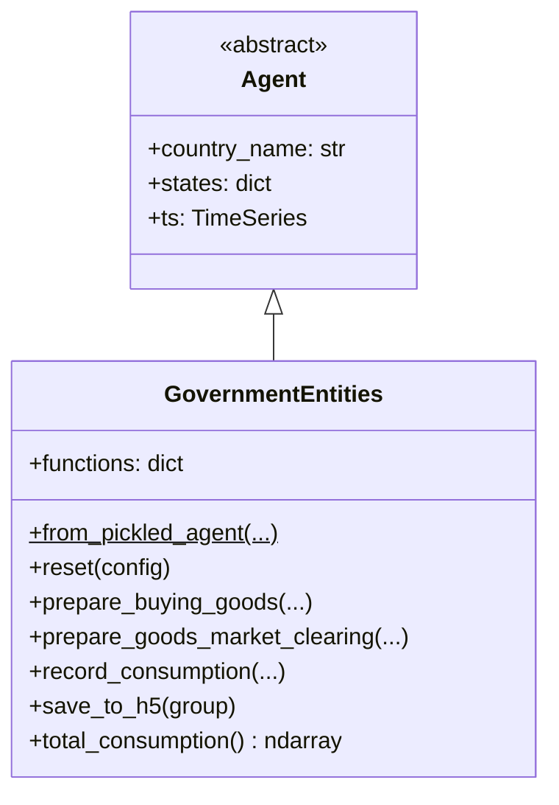

# UML: GovernmentEntities Agent — Progressive PIT Update

This page documents the `GovernmentEntities` agent in the progressive PIT branch.

**PIT impact**: 🟢 **Unchanged.** GovernmentEntities consume goods and services and
optionally track emissions. They are not involved in tax collection — that is handled
entirely by `CentralGovernment`.

---

## 1. Class diagram

---

## 2. PIT-related observations

| Aspect | Detail |
|--------|--------|
| **Consumption** | Uses `government_consumption_model` — unchanged |
| **Revenue source** | Funded by `CentralGovernment` deficit spending — government consumption is an expenditure, not a tax |
| **Tax awareness** | None — GovernmentEntities are pure spenders |

> GovernmentEntities represent the *spending* side of government. The *revenue* side
> (taxation) is fully encapsulated in `CentralGovernment`, which is the only agent
> modified by the PIT update.
