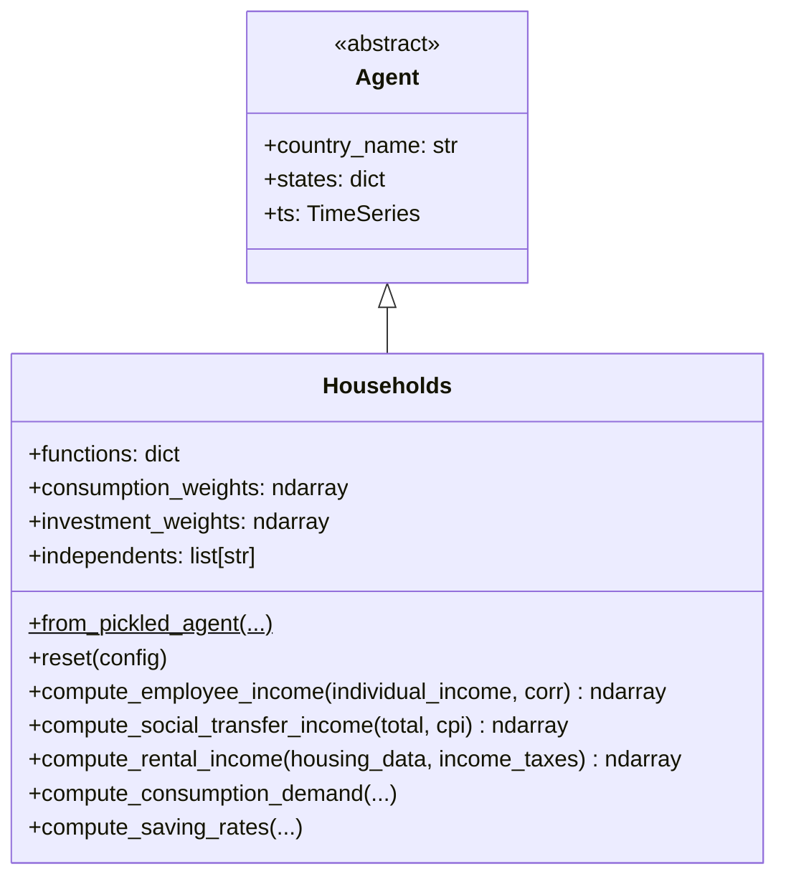

# UML: Households Agent — Progressive PIT Update

This page documents the `Households` agent in the progressive PIT branch.

**PIT impact**: 🟢 **Unchanged.** Households aggregate individual incomes and make
consumption/investment decisions using the scalar `Income Tax` effective rate — they
are unaware of progressive brackets.

---

## 1. Class diagram

---

## 2. PIT-related observations

| Aspect | Detail |
|--------|--------|
| **Income Tax rate** | Reads `states["Income Tax"]` — the scalar effective rate updated by `CentralGovernment` each period |
| **Employee income** | Aggregated from `Individuals` via `np.bincount()` — then passed to `CentralGovernment.compute_taxes()` where progressive PIT is applied |
| **Rental income** | Taxed at flat effective rate (not progressive) |
| **Financial income** | Taxed at flat effective rate (not progressive) |
| **Consumption decisions** | Use `income_taxes` parameter — always the effective scalar rate |

> **Key design invariant**: Household behavioural code (`saving_rates`, `consumption`, `investment`)
> reads the scalar `Income Tax` rate. This means households respond identically whether the
> underlying tax is flat or progressive — only the *effective rate* changes.
