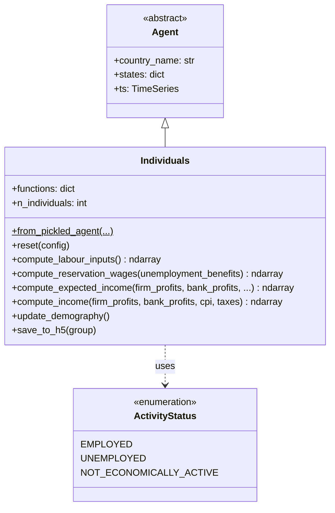
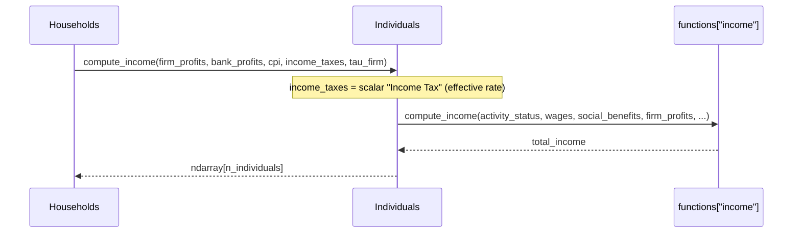

# UML: Individuals Agent — Progressive PIT Update

This page documents the `Individuals` agent in the progressive PIT branch.

**PIT impact**: 🟢 **Unchanged.** The `Individuals` agent has no direct changes from the
PIT update. Individuals continue to supply labor, receive wages, and compute income
identically to the upstream design. The progressive tax computation happens downstream
in `CentralGovernment.compute_taxes()` — individuals are not aware of bracket structures.

---

## 1. Class diagram

**Key `states` attributes:**

| State | Type | Purpose |
|-------|------|---------|
| `Activity Status` | ndarray | Used by CentralGovernment to filter EMPLOYED for progressive PIT |
| `Employee Income` | ndarray | Gross wages before tax — fed to `compute_progressive_tax()` |
| `Income` | ndarray | Total income (wages + benefits + investment returns) |

> **PIT note**: `Activity Status == EMPLOYED` is used by `CentralGovernment` to select which
> individuals' wages are taxed progressively. `Employee Income` flows through `Households` to
> `CentralGovernment.compute_taxes()` where bracket logic applies. Individuals themselves have
> no knowledge of brackets or marginal rates — they only see the effective scalar `Income Tax`.

---

## 2. Sequence diagram — income computation (unchanged)

