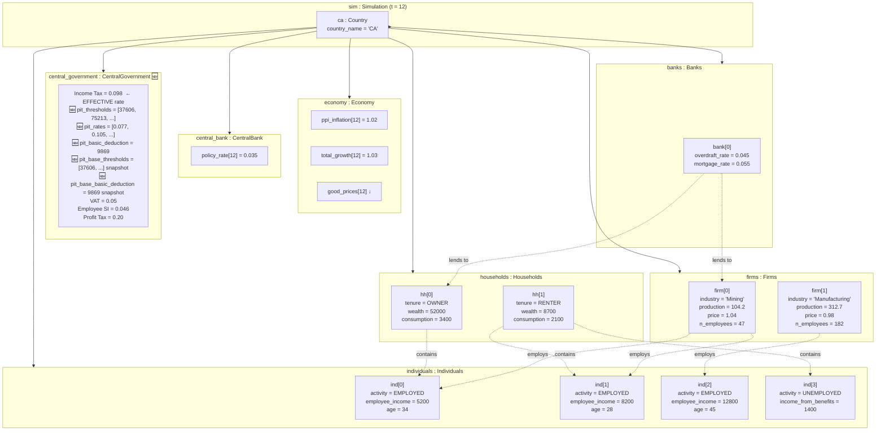

# UML: Object Diagram — Progressive PIT Update

This page shows a concrete snapshot of instances at tick $t = 12$ under the
**progressive PIT design**. Compare with the [upstream flat-tax object diagram](../upstream_model/uml_object.md).

The key difference: `CentralGovernment` now holds 🆕 `pit_thresholds`, `pit_rates`,
and `pit_basic_deduction`, and the scalar `Income Tax` reflects the *effective* rate.

---

---

## Progressive tax calculation for employees at t=12

For each employed individual, the progressive PIT is computed:
1. `taxable_wage = employee_income × (1 - Employee SI)`
2. Apply `compute_progressive_tax(taxable_wage, pit_thresholds, pit_rates)`
3. Subtract non-refundable credit: `min(tax, pit_basic_deduction × lowest_marginal_rate)`

| Individual | Gross Wage | Taxable (after SI) | Bracket(s) hit | Marginal rate(s) | Tax before credit | Credit (9869×0.0506) | Final Tax | Effective rate |
|------------|------------|-------------------|----------------|------------------|-------------------|----------------------|-----------|----------------|
| ind[0] | 5,200 | 4,960.8 | 1st bracket only | 5.06% | 251.0 | 499.4 | 0 | 0.0% |
| ind[1] | 8,200 | 7,822.8 | straddles 1st–2nd | 5.06% / 7.7% | 470.2 | 499.4 | 0 | 0.0% |
| ind[2] | 12,800 | 12,211.2 | straddles 1st–2nd | 5.06% / 7.7% | 831.7 | 499.4 | 332.3 | 2.6% |

> **Note**: Low-income workers (ind[0], ind[1]) pay **zero** PIT after the non-refundable
> credit — the credit exceeds their computed bracket tax.

---

## PIT snapshot values — what changed from upstream

| Attribute | Upstream (flat) | PIT Update (progressive) |
|-----------|-----------------|--------------------------|
| `Income Tax` | 0.25 (statutory flat rate) | 0.098 (effective rate from progressive calc) |
| `pit_thresholds` | ❌ absent | 🆕 `[37606, 75213, 86354, 104858, 150000]` (CPI-inflated) |
| `pit_rates` | ❌ absent | 🆕 `[0.0506, 0.077, 0.105, 0.1229, 0.147, 0.168]` |
| `pit_basic_deduction` | ❌ absent | 🆕 9869 (CPI-inflated) |
| `pit_base_thresholds` | ❌ absent | 🆕 nominal snapshots for repeated CPI indexation |
| `pit_base_basic_deduction` | ❌ absent | 🆕 nominal snapshot |
| All other states | Same | Same |

---

## How to read this

| Notation | UML meaning | Example |
|---|---|---|
| Box with `name : Class` | An object instance | `ca : Country` |
| `attr = value` inside box | Current attribute values (snapshot) | `policy_rate[12] = 0.035` |
| Solid arrow | Composition link (strong ownership) | `Country → Economy` |
| Dashed arrow `-.->` | Runtime association / usage | `firm[0] -.-> ind[0]` |
