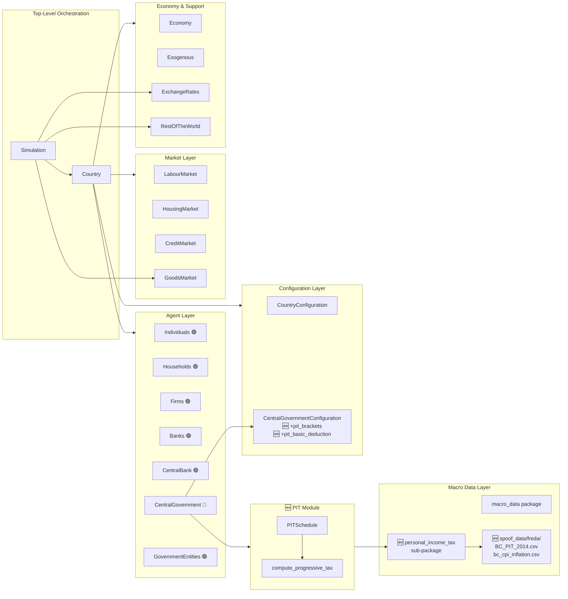
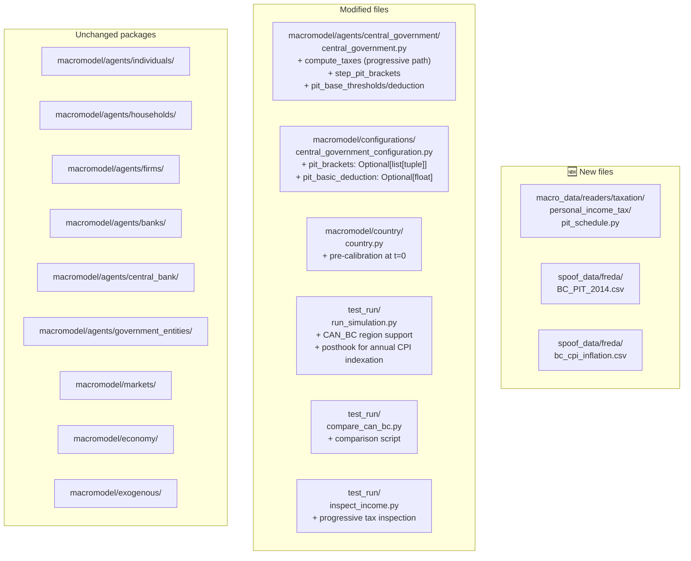

# UML: Package Diagram — Progressive PIT Update

This page shows high-level package dependencies after the PIT update, highlighting
the new `personal_income_tax` sub-package and modified modules.

Compare with the [upstream package diagram](../upstream_model/uml_package.md).

---

## Package dependency diagram (with PIT changes)



---

## Files added/modified by PIT update



---

## Tax data flow — progressive PIT path

```
macro_data/TaxData                           ← Flat rates (from data)
       │
       ▼
CentralGovernment.from_pickled_agent()
       │
       ├── states["Value-added Tax"] = tax_data.value_added_tax          (unchanged)
       ├── states["Income Tax"]       = tax_data.income_tax              (flat fallback)
       ├── states["Profit Tax"]       = tax_data.profit_tax              (unchanged)
       ├── states["Employer SI Tax"]  = tax_data.employer_social_...     (unchanged)
       ├── states["Employee SI Tax"]  = tax_data.employee_social_...     (unchanged)
       ├── states["Capital Formation Tax"] = tax_data.capital_form...    (unchanged)
       └── states["Export Tax"]       = tax_data.export_tax              (unchanged)

🆕 If pit_brackets configured:
       │
       ▼
PITSchedule.from_name_with_cpi("BC_PIT_2014.csv")
       │
       ├── Loads BC_PIT_2014.csv → brackets_df
       ├── Loads/caches bc_cpi_inflation.csv → cpi_rates
       │
       ▼
CentralGovernment.__init__()
       ├── 🆕 pit_base_thresholds = nominal thresholds (snapshot)
       ├── 🆕 pit_base_basic_deduction = nominal deduction (snapshot)
       ├── 🆕 states["pit_thresholds"] = CPI-inflated thresholds
       ├── 🆕 states["pit_rates"] = marginal rates
       └── 🆕 states["pit_basic_deduction"] = CPI-inflated deduction

Each year (posthook):
       │
       ▼
CentralGovernment.step_pit_brackets(tax_year, cpi_map, base_year)
       ├── 🆕 compound_inflation = ∏(1 + CPI_y)
       ├── 🆕 pit_thresholds = pit_base_thresholds × compound_inflation
       └── 🆕 pit_basic_deduction = pit_base_basic_deduction × compound_inflation
```

---

## Component ownership (PIT changes highlighted)

| Component | Changed? | Notes |
|-----------|----------|-------|
| `CentralGovernment` | 🔴 Yes | Progressive brackets, CPI indexation, basic deduction |
| `CentralGovernmentConfiguration` | 🔴 Yes | + `pit_brackets`, + `pit_basic_deduction` |
| `Country` | 🟡 Yes | Pre-calibration at t=0 |
| `pit_schedule.py` | 🆕 New | PITSchedule + compute_progressive_tax |
| `BC_PIT_2014.csv` | 🆕 New | Bracket definitions |
| `bc_cpi_inflation.csv` | 🆕 New | CPI cache (StatCan table 18-10-0005-01) |
| All other agents | 🟢 No | Unchanged |
| All markets | 🟢 No | Unchanged |
| `Economy` | 🟢 No | Unchanged |
| `Exogenous` | 🟢 No | Unchanged |
