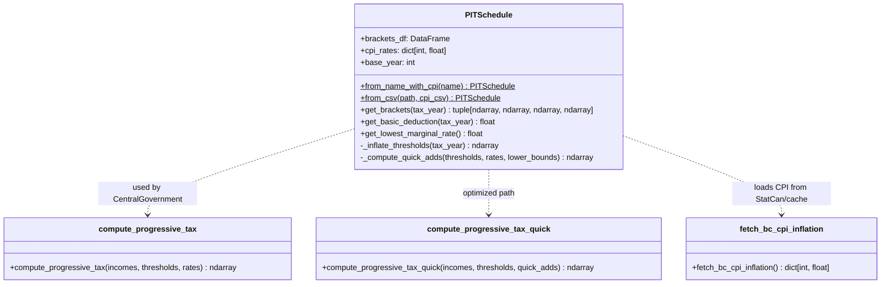
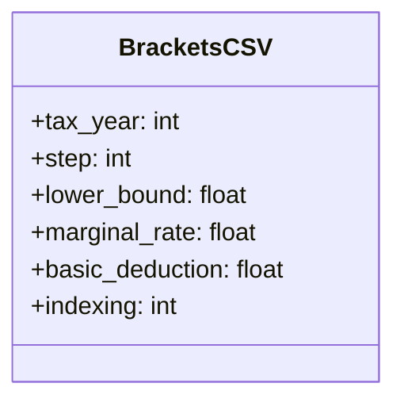
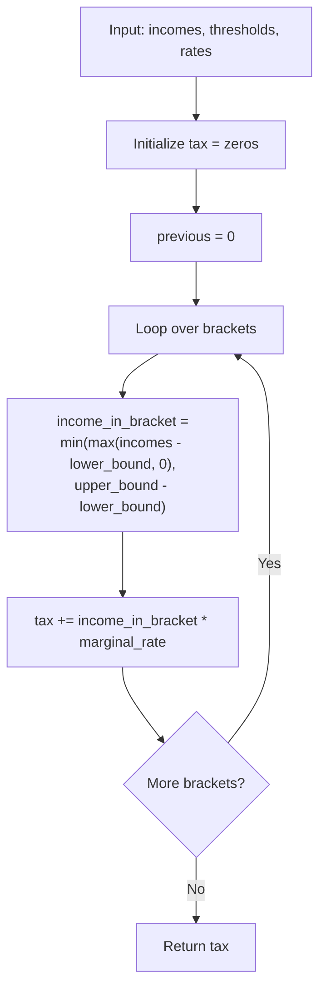
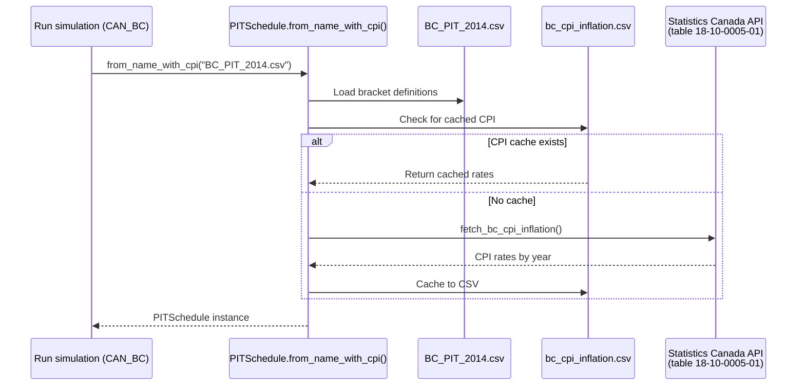
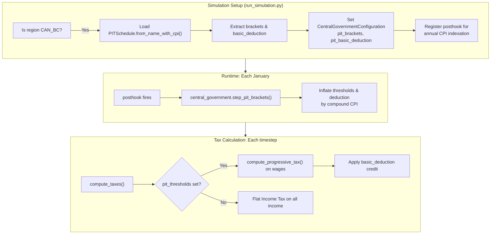

# UML: PIT (Progressive Income Tax) Module — Architecture

This page documents the new `pit_schedule.py` module introduced by the progressive PIT update.
It lives in `macro_data/readers/taxation/personal_income_tax/` and provides:

- Multi-bracket tax schedule loading from CSV
- CPI inflation indexation of bracket thresholds
- Vectorized progressive tax computation
- Non-refundable basic personal amount support

Compare with the [upstream design](../upstream_model/uml_package.md) which has no such module.

---

## 1. Class diagram — PITSchedule and compute functions



---

## 2. CSV data format — `BC_PIT_2014.csv`



| Column | Type | Example | Description |
|--------|------|---------|-------------|
| `tax_year` | int | 2014 | Tax year the bracket applies to |
| `step` | int | 1 | Bracket number (ordered) |
| `lower_bound` | float | 37606 | Lower income bound of bracket |
| `marginal_rate` | float | 0.077 | Marginal tax rate within bracket |
| `basic_deduction` | float | 9869 | Basic personal amount (non-refundable) |
| `indexing` | int | 1 | Whether bracket is CPI-indexed (0 or 1) |

Example brackets for BC 2014:
```
tax_year,step,lower_bound,marginal_rate,basic_deduction,indexing
2014,1,0,0.0506,9869,1
2014,2,37606,0.077,9869,1
2014,3,75213,0.105,9869,1
2014,4,86354,0.1229,9869,1
2014,5,104858,0.147,9869,1
2014,6,150000,0.168,9869,1
```

---

## 3. Activity diagram — `PITSchedule.get_brackets()` for a target year

```mermaid
flowchart TD
    A[Start: get_brackets(tax_year)] --> B{target == base_year?}
    B -->|Yes| C[Return nominal thresholds & rates]
    B -->|No| D["Compute compound inflation:<br/>infl = ∏ (1 + CPI_y)<br/>for y in base_year+1 .. tax_year"]
    D --> E["Inflate thresholds:<br/>threshold = nominal * infl"]
    E --> F["Inflate basic_deduction:<br/>deduction = nominal * infl"]
    F --> G[Return (thresholds, rates, lower_bounds, quick_adds)]
    C --> G
```

---

## 4. `compute_progressive_tax()` algorithm



**Mathematical representation:**

For each individual with taxable income $y$:

$$T(y) = \sum_{b=1}^{B} r_b \cdot \min(\max(y - L_b, 0), U_b - L_b)$$

where:
- $B$ = number of brackets
- $r_b$ = marginal rate for bracket $b$
- $L_b$ = lower bound of bracket $b$
- $U_b$ = upper bound of bracket $b$

After progressive tax calculation, the non-refundable credit is applied:
$$\text{Tax}_{\text{final}} = \max(0, T(y) - D \cdot r_1)$$

where $D$ is the basic deduction and $r_1$ is the lowest marginal rate.

---

## 5. CPI data flow



---

## 6. Integration into simulation


