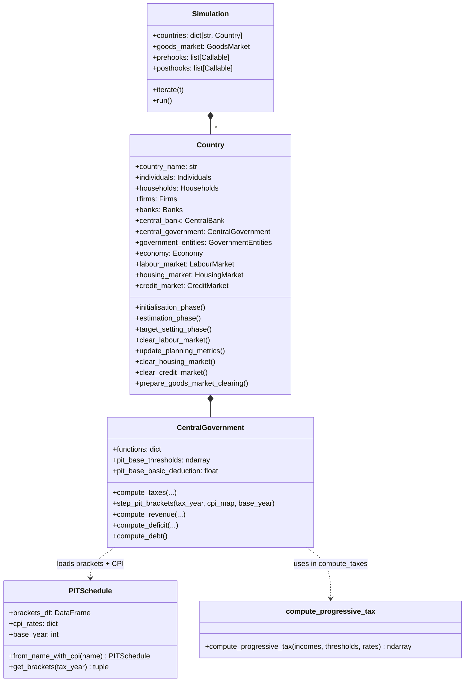
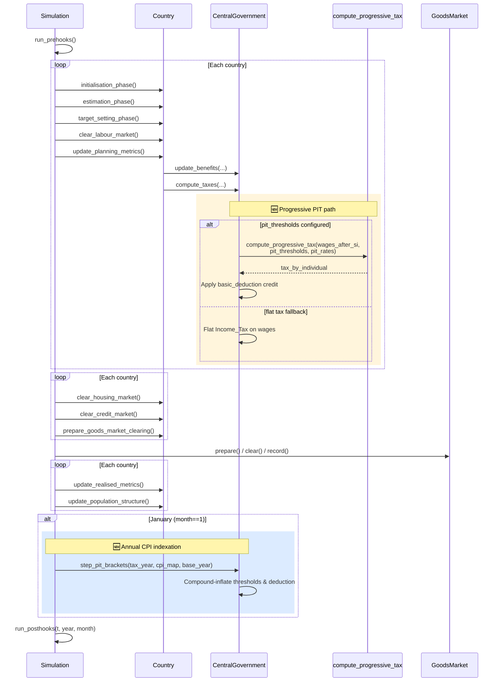
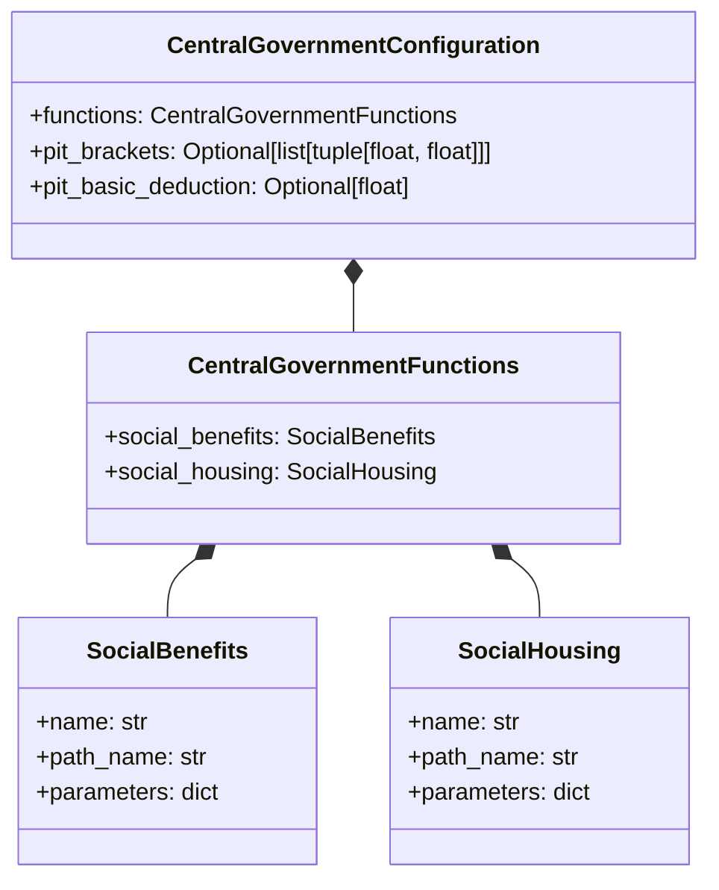

# UML: System-Wide Integration — Progressive PIT Changes

This page shows the **diff** from the original upstream system architecture. It highlights
which components are modified, added, or unchanged by the progressive PIT update.

Compare with the [upstream system-wide diagram](../upstream_model/uml_system_wide.md).

---

## 1. Change overview — components affected

```mermaid
flowchart LR
    subgraph NEW ["🆕 New Components"]
        pit_schedule[PITSchedule<br/>macro_data/readers/taxation/]
        bc_pit[BC_PIT_2014.csv<br/>spoof_data/freda/]
        bc_cpi[bc_cpi_inflation.csv<br/>spoof_data/freda/]
    end

    subgraph MODIFIED ["Modified Components"]
        cg_config[CentralGovernmentConfiguration<br/>+ pit_brackets<br/>+ pit_basic_deduction]
        cg_agent[CentralGovernment<br/>+ step_pit_brackets()<br/>+ pit_base_thresholds<br/>+ pit_base_basic_deduction]
        country[Country<br/>+ pre-calibration at t=0]
        run_sim[run_simulation.py<br/>+ CAN_BC region support<br/>+ posthook registration]
    end

    subgraph UNCHANGED ["Unchanged Components"]
        individuals[Individuals]
        firms[Firms]
        banks[Banks]
        central_bank[CentralBank]
        government_entities[GovernmentEntities]
        labour_market[LabourMarket]
        housing_market[HousingMarket]
        credit_market[CreditMarket]
        goods_market[GoodsMarket]
        economy[Economy]
        exogenous[Exogenous]
    end

    cg_config --> cg_agent
    pit_schedule --> cg_agent
    pit_schedule --> bc_pit
    pit_schedule --> bc_cpi
    cg_agent --> country
    run_sim --> country
```

---

## 2. Cross-agent class diagram — changes highlighted

Only `CentralGovernment` and `Country` are modified. All other agents unchanged.



---

## 3. Sequence diagram — one timestep with PIT changes highlighted



---

## 4. Configuration diff — PIT fields added to `CentralGovernmentConfiguration`



> **🆕 Fields added** to `CentralGovernmentConfiguration`:
> - `pit_brackets: Optional[list[tuple[float, float]]]` — `None` = flat tax (backward compatible)
> - `pit_basic_deduction: Optional[float]` — Non-refundable basic personal amount

---

## 5. Key design invariants (unchanged by PIT update)

| Invariant | Description |
|-----------|-------------|
| **Behavioural code uses scalar `Income Tax`** | Wage-setting, after-tax income, saving rates all read `states["Income Tax"]` |
| **Dual tracking** | `pit_thresholds`/`pit_rates` for progressive calc; `Income Tax` updated to effective rate each period |
| **Employee-only progressivity** | Only wages use brackets; rental & financial income stay flat |
| **Backward compatible** | `pit_brackets=None` → flat tax (original behaviour preserved) |
| **CPI indexation is compound** | `threshold = nominal × ∏(1+CPI_y)` — preserves nominal base for safe repeated calls |
| **Non-refundable credit** | Credit = `basic_deduction × lowest_marginal_rate`; tax cannot go below zero |
