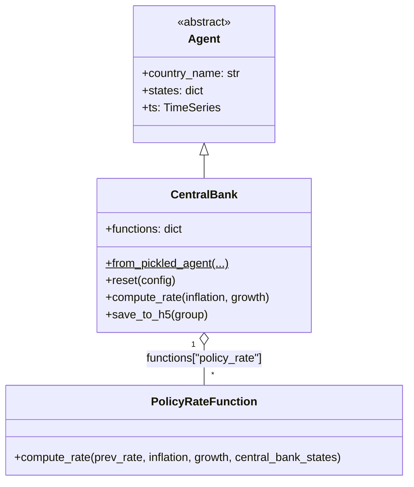
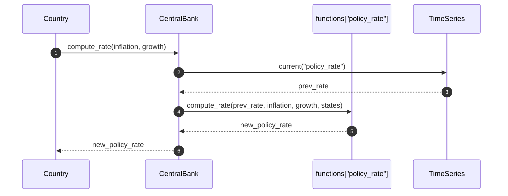
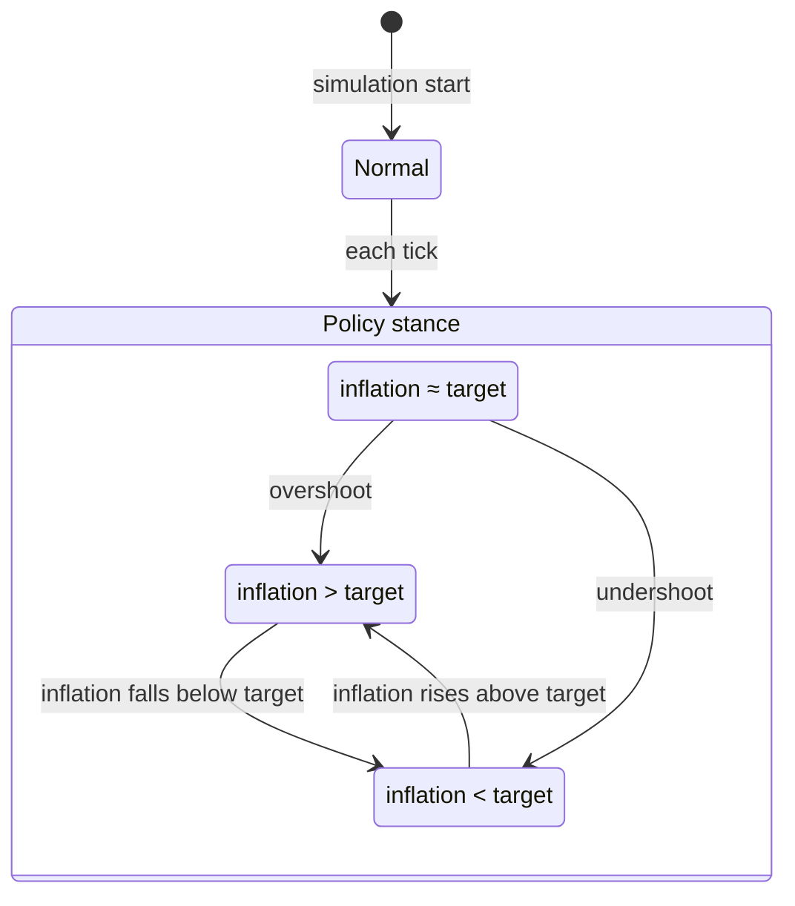
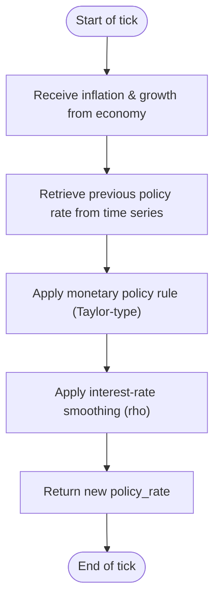

# UML Demo: The `CentralBank` Agent

This page applies Bersini's four-diagram UML subset to the [`CentralBank`](../../macromodel/agents/central_bank/central_bank.py)
agent — the monetary policy authority. See the [Individuals UML demo](uml_individual_agent_demo.md) for methodology references.

Reference: Bersini, H. (2012). [*UML for ABM*](https://www.jasss.org/15/1/9.html). JASSS 15(1)9.

---

## 1. Class diagram

`CentralBank` is the simplest agent: inherits from `Agent`, holds a single strategy
(`policy_rate`), and tracks a handful of monetary-policy parameters in `states`.

**Key `states` parameters (Taylor-rule family):**

| State | Role |
|-------|------|
| `targeted_inflation_rate` | π* — inflation target |
| `rho` | Interest-rate smoothing coefficient |
| `r_star` | r* — natural real interest rate |
| `xi_pi` | ξ_π — inflation gap response |
| `xi_gamma` | ξ_γ — output growth response |

---

## 2. Sequence diagram

One method, one flow: the central bank computes the policy rate from inflation and growth.

---

## 3. State diagram

The central bank operates in two policy stances differentiated by the inflation gap.

---

## 4. Activity diagram

---

*See also:* [Banks UML demo](uml_banks_agent_demo.md), [Bersini (2012)](https://www.jasss.org/15/1/9.html).
