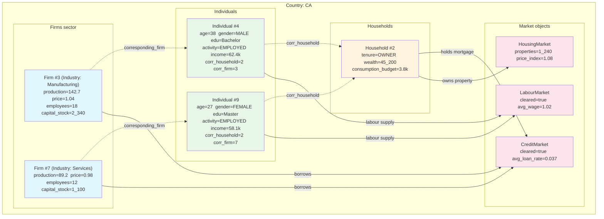
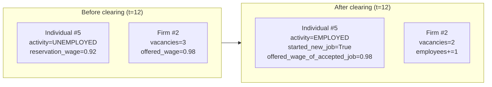

# UML Demo: Object Diagram

An **object diagram** is a snapshot of instances at a single point in time.
While a class diagram says "a Firm *has* a price," an object diagram says
"Firm #3's price = 1.04 at `t=12`." This follows Collins et al. (2015) who
recommend object diagrams for ABM verification: *"does the state at tick n
actually match what the sequence diagram predicted?"*

Bersini does not cover object diagrams, but they are the fourth diagram in the
"structural" family alongside class, package, and component diagrams. They are
invaluable for debugging and onboarding — a new contributor can see what a
"healthy" simulation state looks like.

## Snapshot: mid-simulation tick (t=12, Country=CA)

This shows 2 Firms, 1 Household, 2 Individuals, and their concrete state
values. Arrows represent runtime links (instance-level associations, not UML
associations).

**Key observations:**

- `Individual #4` works at `Firm #3` in Manufacturing. `Individual #9` works at
  `Firm #7` in Services. Both belong to `Household #2`.
- This is the pattern the class diagram prescribes: each `Individual` has
  one `corresponding_firm` and one `corresponding_household`. The object
  diagram proves those links exist at runtime.
- The household participates in both the credit market (mortgage) and the
  housing market (property ownership), while firms only participate in the
  credit market.

---

## Second snapshot: pre/post labour-market clearing

Sometimes the most useful object diagram is **before-and-after** — the same
two objects at two moments.

This is the exact scenario traced by the Individuals state diagram
(`UNEMPLOYED → EMPLOYED`) and by the labour-market sequence in the system-wide
sequence diagram. It answers: *did the matching logic actually place this
unemployed individual into this firm?*

---

## Why object diagrams matter for ABM

Collins et al. (2015) note that ABMs are uniquely suited to object diagrams
because:

1. Every agent is a discrete instance with a unique ID — the diagram mirrors
   the runtime reality 1:1.
2. Before/after snapshots are the fastest way to verify a market-clearing
   or state-transition logic.
3. They bridge the gap between the class diagram (what *can* exist) and the
   debugger (what *does* exist at a given tick).

For this repo, an object diagram is especially useful when debugging the
labour market (`LabourMarket.clear`) or tracing an individual's income
computation (`compute_income`).

## References

- Collins, A. et al. (2015). *UML for agent-based modelling and simulation.*
- UML 2.5 Specification, §9 — Object diagrams.
