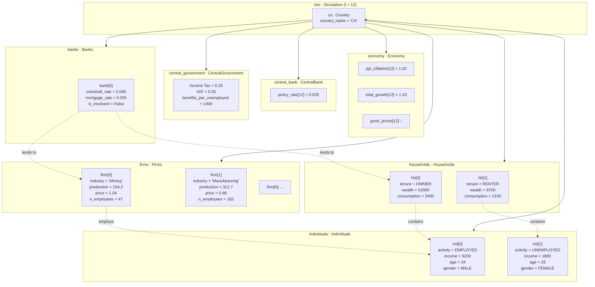

# UML Demo: Object Diagram

While class diagrams show the abstract structure, an **object diagram** shows
a concrete snapshot of instances at one moment in time — the "debugging
diagram." Collins et al. (2015) specifically advocate object diagrams for ABM
verification: "does the state at tick *n* match what the sequence diagram
predicted?"

This snapshot corresponds to tick $t = 12$ (one year into a quarterly
simulation) for `Country("CA")`.

## How to read this

| Notation | UML meaning | Example |
|---|---|---|
| Box with name:Class | An object instance | `ca : Country` |
| `attr = value` inside box | Current attribute values (snapshot) | `policy_rate[12] = 0.035` |
| Solid arrow | Composition link (strong ownership) | `Country → Economy` |
| Dashed arrow `-.->` | Runtime association / usage | `firm[0] -..-> ind[0]` |

**Why this matters:** Note that at $t = 12$:

- `firm[0]`'s price (1.04) is above `firm[1]`'s (0.98), consistent with good_prices.
- `ind[1]` is `UNEMPLOYED` and receiving ~1,400 in benefits — exactly what
  `CentralGovernment.benefits_per_unemployed` says.
- `bank[0]` is solvent and lending to both a firm and a household (no NPL
  crisis at this tick).

A developer who just ran `Simulation.iterate()` can compare this snapshot to
the simulator's memory dump and verify correctness.

## References

- Collins, A., Petty, M., Vernon-Bido, D., & Sherfey, S. (2015). A Call to Arms:
  Standards for Agent-Based Modeling and Simulation. *JASSS* 18(3)12.
- Bersini, H. (2012). UML for ABM. *JASSS* 15(1)9. (Does not cover object
  diagrams, but §§3.2–3.4 on Schelling describe exactly this kind of snapshot
  for verification.)
