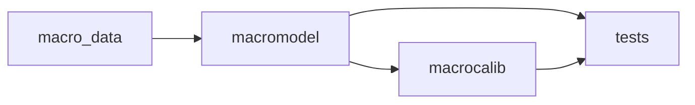
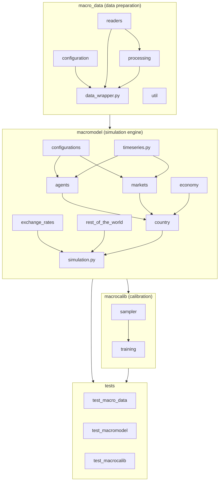
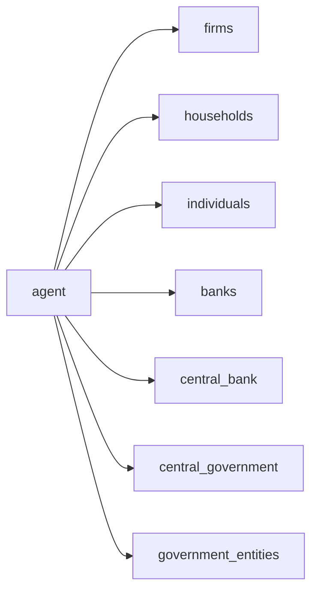

# UML Demo: Package Diagram

A **package diagram** showing the module-level dependency structure of the
repository. This follows the recommendation of Collins et al. (2015) and
Niazi & Hussain (2012) that ABM codebases benefit from a "table of contents"
diagram before diving into per-class detail.

Compare Bersini §1.4: *"UML provides a level of abstraction higher than that
provided by OO programming languages."* The package diagram sits one level
above the class diagram — it shows what depends on what *at the import level*.

## Top-level packages

`macro_data` has zero dependencies on the other two — it is pure data
preparation. `macromodel` depends on `macro_data` (it consumes the processed
data). `macrocalib` depends on both (it runs `macromodel` simulations and
trains on `macro_data`).

---

## Full package structure

---

## Agent sub-packages (inside `macromodel.agents`)

All agent types inherit from `macromodel.agents.agent.Agent`. There are no
other cross-dependencies: agents interact only through markets and through
the `Country` orchestrator, not by importing each other.

---

## Market sub-packages (inside `macromodel.markets`)

Markets are independent of each other — they are composed into `Country` and
called in sequence. The global `GoodsMarket` is the only market that lives at
the `Simulation` level (not per-country).

---

## Why a package diagram?

Bersini omitted it (§4.5: *"use case, component and deployment diagrams …
should be of minor importance for most ABM modelling endeavours"*), but
subsequent ABM-UML work (Niazi & Hussain 2012; Collins et al. 2015) argues
that package diagrams are the **first diagram a new contributor needs** because:

1. They answer "where is the code I need to touch?"
2. They make circular-dependency violations visually obvious.
3. They cost almost nothing to maintain — the package structure changes far
   less often than class details.

For a codebase of this size (25+ sub-packages), the package diagram is the
single highest-value-per-pixel diagram you can draw.

## References

- Collins, A. et al. (2015). *UML for agent-based modelling and simulation.*
- Niazi, M. & Hussain, A. (2012). *Agent-based tools for modeling and
  simulation.*
