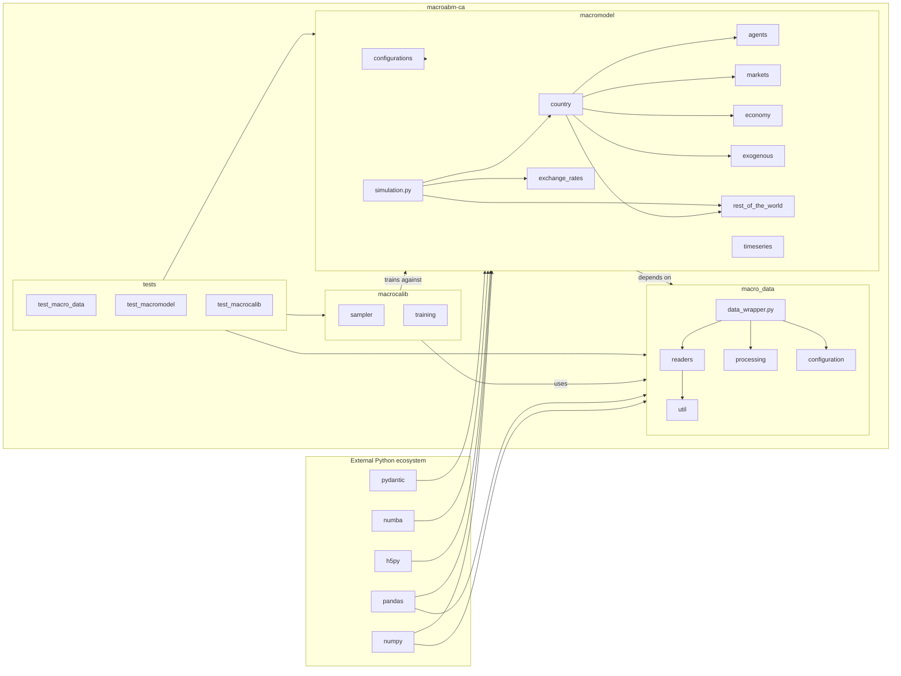

# UML Demo: Package Diagram

This diagram shows the **module-level dependency structure** of the
`macroabm-ca` codebase — a "table of contents" for the repository that
no other UML diagram provides. Package diagrams were the most frequently
recommended addition in the post-Bersini ABM/UML literature (Collins et al.
2015; Niazi & Hussain 2012).

Each box is a top-level Python package in this repo. Arrows indicate
*pacakge dependency* (i.e., `A → B` means `A` imports from `B`).

## Reading notes

| Package | Role | Key dependencies |
|---|---|---|
| `macro_data` | Data ingestion, synthetic-country generation, configuration | `pandas`, `numpy` |
| `macromodel` | Simulation engine: agents, markets, country orchestration | `macro_data`, `numpy`, `numba`, `h5py`, `pydantic` |
| `macrocalib` | Calibration: sampling, training routines | `macromodel`, `macro_data` |
| `tests` | Unit/integration tests for all three packages | All three |

The diagram makes explicit what `pyproject.toml` declares via `[tool.setuptools.packages]`
but doesn't visualize: `macromodel` is the central package; everything else
either feeds data in or validates/calibrates the output.

## References

- Collins, A., Petty, M., Vernon-Bido, D., & Sherfey, S. (2015). A Call to Arms:
  Standards for Agent-Based Modeling and Simulation. *JASSS* 18(3)12.
- Niazi, M. A., & Hussain, A. (2012). Cognitive Agent-based Computing-I: A
  Unified Framework for Modeling Complex Adaptive Systems using Agent-based &
  Complex Network-based Methods. Springer.
