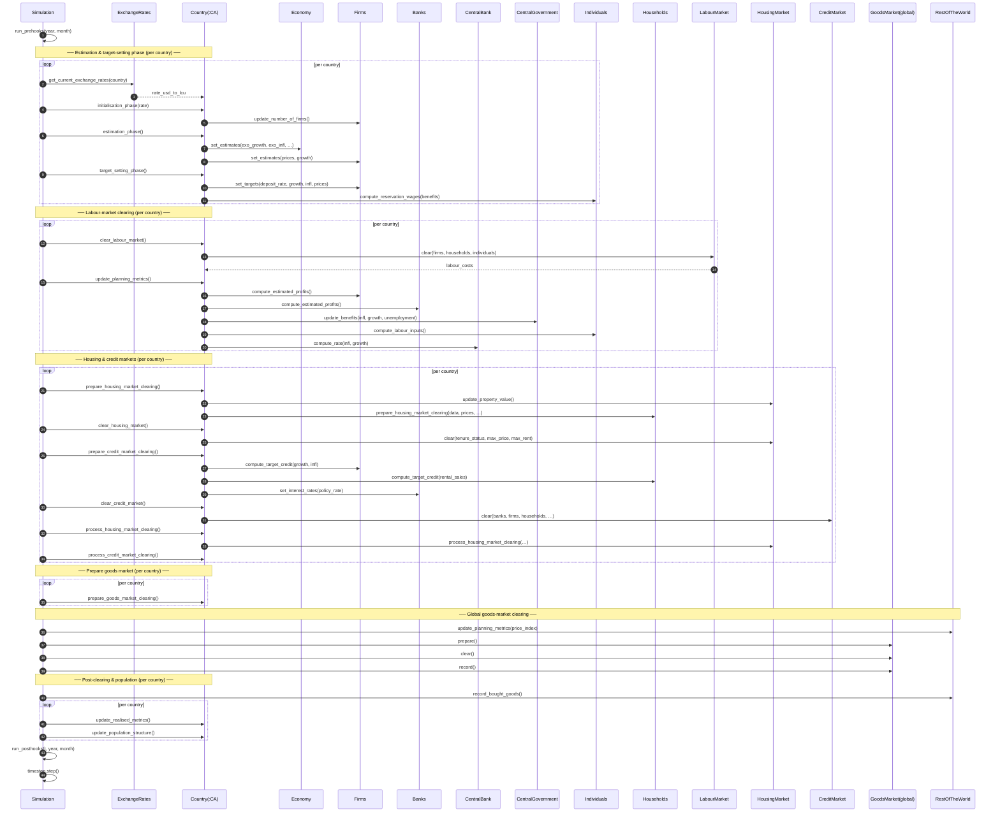
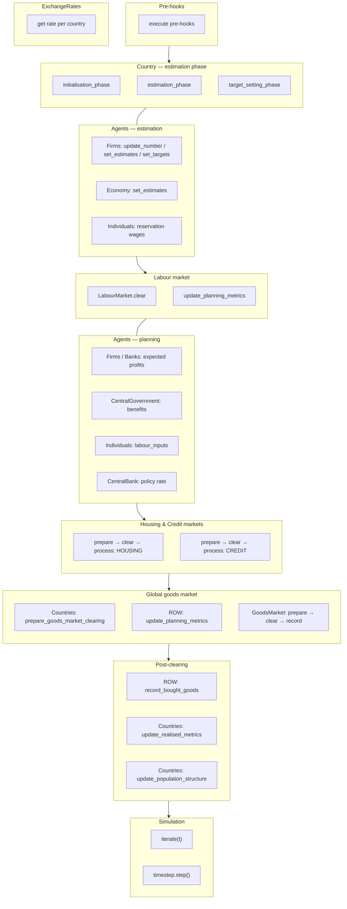

# UML Demo: System-Wide (Cross-Agent) Diagrams

This page extends the [UML for ABM](https://www.jasss.org/15/1/9.html) demo
from individual agents to the **full model architecture**. Bersini's paper
shows three kinds of cross-agent diagrams that sit one level above per-agent
ones:

| Bersini figure | Diagram | What it shows |
|---|---|---|
| Fig 1, 2, 11, 12 | Cross-agent **class diagram** | How agents, markets, world/simulation relate structurally |
| Fig 3, 4, 9, 11 | Cross-agent **sequence diagram** | Who calls whom across agent boundaries during a tick |
| Fig 7 | Cross-agent **activity diagram** | Procedural flow with swimlanes per actor |

All three are provided below for this repository, using the same Mermaid
notation as the per-agent pages.

---

## 1. Cross-agent class diagram (structural skeleton)

This shows every agent class, every market, and the `Country` / `Simulation`
orchestrators — all in one diagram. Compare Bersini's Figures 1 and 12.

```mermaid
classDiagram
    direction TB

    class Simulation {
        +countries: dict[str, Country]
        +goods_market: GoodsMarket
        +exchange_rates: ExchangeRates
        +rest_of_the_world: RestOfTheWorld
        +timestep: Timestep
        +iterate(t)
        +run()
    }

    class Country {
        +country_name: str
        +economy: Economy
        +firms: Firms
        +households: Households
        +individuals: Individuals
        +banks: Banks
        +central_bank: CentralBank
        +central_government: CentralGovernment
        +government_entities: GovernmentEntities
        +labour_market: LabourMarket
        +housing_market: HousingMarket
        +credit_market: CreditMarket
        +initialisation_phase()
        +estimation_phase()
        +target_setting_phase()
        +clear_labour_market()
        +update_planning_metrics()
        +clear_housing_market()
        +clear_credit_market()
        +prepare_goods_market_clearing()
    }

    class Economy {
        +ts: TimeSeries
        +set_estimates()
    }

    class GoodsMarket {
        +prepare()
        +clear()
        +record()
    }

    class LabourMarket {
        +clear(firms, households, individuals)
    }

    class HousingMarket {
        +states
        +ts
        +update_property_value()
        +clear(...)
        +process_housing_market_clearing(...)
    }

    class CreditMarket {
        +clear(banks, firms, households, ...)
    }

    class Agent {
        <<abstract>>
        +country_name: str
        +states: dict
        +ts: TimeSeries
    }

    class Firms {
        +update_number_of_firms()
        +set_estimates()
        +set_targets()
        +compute_estimated_profits()
        +compute_target_credit()
    }

    class Households {
        +prepare_housing_market_clearing()
        +update_rent()
        +compute_target_credit()
    }

    class Individuals {
        +compute_labour_inputs()
        +compute_reservation_wages()
        +compute_income()
        +update_demography()
    }

    class Banks {
        +compute_estimated_profits()
        +set_interest_rates()
    }

    class CentralBank {
        +compute_rate()
    }

    class CentralGovernment {
        +update_benefits()
        +distribute_unemployment_benefits_to_individuals()
    }

    class GovernmentEntities

    class ExchangeRates
    class RestOfTheWorld
    class Timestep

    Simulation "1" *-- "1..*" Country : composes
    Simulation "1" *-- "1" GoodsMarket
    Simulation "1" *-- "1" ExchangeRates
    Simulation "1" *-- "1" RestOfTheWorld
    Simulation "1" *-- "1" Timestep

    Country "1" *-- "1" Economy
    Country "1" *-- "1" LabourMarket
    Country "1" *-- "1" HousingMarket
    Country "1" *-- "1" CreditMarket

    Agent <|-- Individuals
    Agent <|-- Households
    Agent <|-- Firms
    Agent <|-- Banks
    Agent <|-- CentralBank
    Agent <|-- CentralGovernment
    Agent <|-- GovernmentEntities

    Country "1" *-- "1" Individuals
    Country "1" *-- "1" Households
    Country "1" *-- "1" Firms
    Country "1" *-- "1" Banks
    Country "1" *-- "1" CentralBank
    Country "1" *-- "1" CentralGovernment
    Country "1" *-- "1" GovernmentEntities
```

**Key observations:**

- The **black diamonds** (composition) between `Country` and its agents mean
  agents live and die with their parent country — exactly as the paper's
  Figure 1 composes `Site`, `Agent`, and `Resource` into `World`.
- `Agent` is **abstract**: no plain `Agent` is ever instantiated. The concrete
  leaf classes (`Firms`, `Households`, `Individuals`, `Banks`, …) provide the
  real behaviour.
- The architecture cleanly separates *agents* (who make decisions) from
  *markets* (who match supply and demand) — a pattern the paper endorses at
  §2.8.

---

## 2. Cross-agent sequence diagram (one full tick)

This traces the **entire `Simulation.iterate()` call flow** through Country,
every agent type, and every market. It follows the paper's Figures 9 and 11
(which trace Schelling and evolutionary-game ticks).

For readability, only one country is shown. Multi-country `for` loops over
`self.countries.values()` are labelled with `loop [per country]`.

**Reading notes (Bersini §2.12–2.16):**

- This diagram intentionally stays at the *responsibility* level: it shows which
  agent is asked to do what and in what order, without nested `loop`/`alt`
  frames or parameter passing details.
- The global goods market (bottom section) is Belini's "collaborating elements"
  pattern — the `GoodsMarket` doesn't belong to a single country; it reconciles
  supply and demand across all countries plus the rest-of-world.

---

## 3. Cross-agent activity diagram (swimlane view)

Where the sequence diagram is chronological, the activity diagram groups
actions by **who performs them**. This follows Bersini's Figure 7 pattern and
the final paragraphs of §2.20–2.22, which encourage swimlane partitioning
when behaviour spans multiple actors.

In essence, the activity diagram tells the same story as the sequence diagram,
but from the perspective of *what block of work* happens next, rather than
*who calls whom*.

**Swimlanes (logical, not drawn as Mermaid swimlanes):**

| Column | Actor |
|---|---|
| 1 | Pre-hooks (user-defined injection points) |
| 2 | `ExchangeRates` |
| 3 | `Country.initialisation → estimation → target_setting` |
| 4 | Firm / Economy / Individual expectations |
| 5 | `LabourMarket` clearing |
| 6 | Central-government / Central-bank / profit updates |
| 7 | `HousingMarket` + `CreditMarket` (prepare → clear → process) |
| 8 | Global `GoodsMarket` (prepare → clear → record) |
| 9 | `ROW` + per-country post-clearing |
| 10 | `Simulation.run_posthooks()`, then `timestep.step()` |

---

## Why these three together?

Bersini's core claim is that **different diagrams are useful at different
moments** (§1.7, §4.1–4.2):

- The **class diagram** is for architecture discussion and onboarding — you
  draw it once and it stays valid across many ticks.
- The **sequence diagram** is for debugging one specific scenario — you trace
  a tick, or part of a tick, to see if responsibilities are in the right
  place.
- The **activity diagram** is for procedural flow — when you need to explain
  “what happens in a step” to a non-implementer.

Having all three for the same codebase means you can pick whichever one answers
today's question.

## Reference

Bersini, H. (2012). *UML for ABM*. Journal of Artificial Societies and Social
Simulation 15 (1) 9. <https://www.jasss.org/15/1/9.html>
