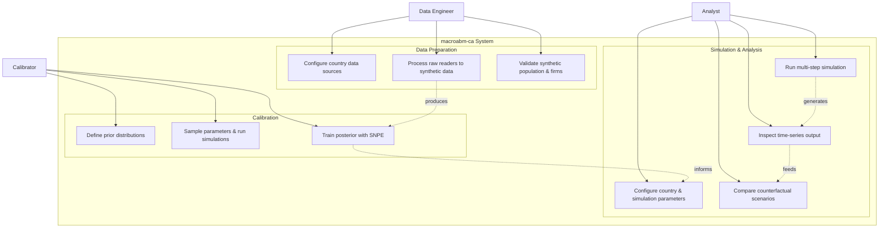

# UML Demo: Use Case Diagram

A **use case diagram** capturing the three primary user personas of this
repository and how they interact with the system. Bersini omitted this diagram
(§4.5: *"use case … should be of minor importance for most ABM modelling
endeavours"*), but Kravari & Bassiliades (2015) and subsequent work argue
that any ABM with multiple user roles benefits from distinguishing *who does
what*.

This repo has three distinct personas:

| Persona | Goal | Primary entry point |
|---|---|---|
| **Data Engineer** | Prepare synthetic data from raw sources | `DataWrapper.from_config()` |
| **Calibrator** | Tune model parameters to match empirical targets | `Sampler` / `train_model()` |
| **Analyst** | Run scenarios and interpret outputs | `run_simulation.py` → `Simulation.run()` |

---

## Top-level use case



Dashed arrows between use cases indicate **data flow**, which is not part of
the canonical use case diagram but clarifies the pipeline for this specific
ABM workflow.

---

## Detailed use cases

### UC1: Configure country data sources

```
Title: Configure country data sources
Actor: Data Engineer
Precondition: Raw data files (IO tables, HFCS, Compustat, etc.) exist on disk
Main flow:
  1. Engineer selects country codes (e.g. "CAN", "FRA")
  2. Engineer assigns proxy country for non-EU countries
  3. Engineer sets time unit (monthly/quarterly)
  4. System creates DataConfiguration with Country objects
  5. Engineer specifies which readers to use (defaults or custom)
Postcondition: DataConfiguration is ready for processing
```

### UC5: Sample parameters & run simulations

```
Title: Sample parameters & run simulations
Actor: Calibrator
Precondition: DataWrapper and SimulationConfiguration exist
Main flow:
  1. Calibrator defines prior distributions over model parameters
  2. Calibrator selects number of samples and CPU cores
  3. System instantiates one Simulation per core
  4. For each sample: system updates config, runs Sim, records observables
  5. System returns (theta_matrix, obs_matrix) as torch tensors
Postcondition: Simulation data ready for SNPE training
```

### UC8: Run multi-step simulation

```
Title: Run multi-step simulation
Actor: Analyst
Precondition: DataWrapper built, SimulationConfiguration ready
Main flow:
  1. Analyst selects country and proxy
  2. Analyst sets scale, t_max, and seed
  3. System builds Simulation.from_datawrapper()
  4. System runs Simulation.run() for t_max steps
  5. System writes time-series output to HDF5
Postcondition: Output file saved to output/ directory
```

---

## Why add a use case diagram?

Bersini's omission was reasonable for **single-developer, single-purpose**
models where the person who writes the code is also the person who calibrates
and the person who analyses results. But:

1. This repo already has three entry scripts with different `argparse` flags
   targeting different workflows — the use case diagram reflects that
   reality.
2. Kravari & Bassiliades (2015) show that ABMs with a calibration loop
   (like this one, with `macrocalib`) have a distinct "calibrator" persona
   whose workflow is fundamentally different from scenario analysis.
3. Use case diagrams are the **only UML diagram surface that non-programmers
   can read and validate**. A policy analyst who will never read `country.py`
   can still confirm that UC8–UC10 match what they need.

## References

- Kravari, K. & Bassiliades, N. (2015). *A Survey of Agent Platforms.*
  Journal of Artificial Societies and Social Simulation.
- Cockburn, A. (2000). *Writing Effective Use Cases.* Addison-Wesley.
