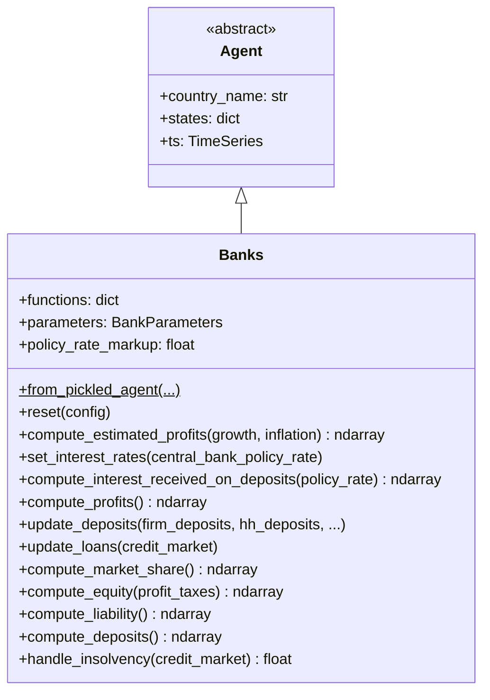
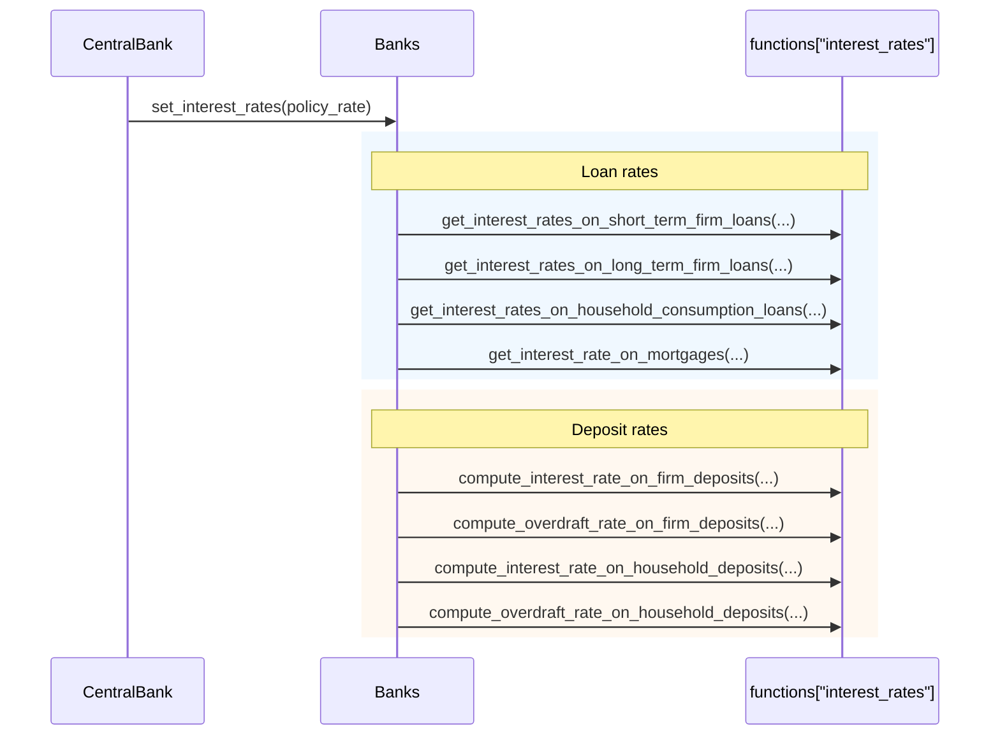

# UML: Banks Agent — Original Upstream Design

This page documents the `Banks` agent from the original upstream
[`uvic-sesit/macroabm-ca`](https://github.com/uvic-sesit/macroabm-ca) design.

`Banks` intermediate between savers and borrowers, managing deposits, loans,
interest rates, and financial stability.

Reference: Bersini, H. (2012). [*UML for ABM*](https://www.jasss.org/15/1/9.html). JASSS 15(1)9.

---

## 1. Class diagram

**Key `states` attributes:**

| State | Type | Purpose |
|-------|------|---------|
| `corr_firms` | list | Firm-bank mapping |
| `corr_households` | list | Household-bank mapping |
| `is_insolvent` | ndarray | Bankruptcy flag |
| `Firm Pass Through` | float | Interest rate pass-through to firms |
| `Firm ECT` | float | Error correction term (firms) |
| `Household Consumption Pass Through` | float | Rate pass-through (consumption loans) |
| `Household Consumption ECT` | float | ECT (consumption loans) |
| `Household Mortgage Pass Through` | float | Rate pass-through (mortgages) |
| `Household Mortgage ECT` | float | ECT (mortgages) |

---

## 2. Sequence diagram — interest rate setting

