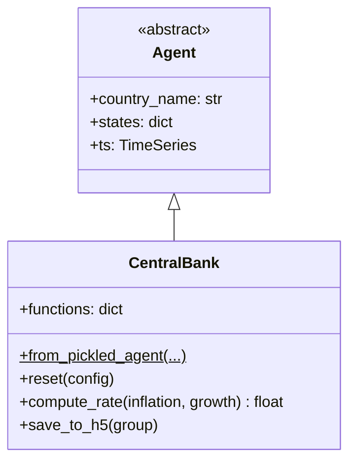

# UML: CentralBank Agent — Original Upstream Design

This page documents the `CentralBank` agent from the original upstream
[`uvic-sesit/macroabm-ca`](https://github.com/uvic-sesit/macroabm-ca) design.

The `CentralBank` implements monetary policy through interest rate setting,
using a policy rule that responds to inflation and output gaps.

Reference: Bersini, H. (2012). [*UML for ABM*](https://www.jasss.org/15/1/9.html). JASSS 15(1)9.

---

## 1. Class diagram



**Key `states` (monetary policy parameters):**

| State | Type | Purpose |
|-------|------|---------|
| `targeted_inflation_rate` | float | Inflation target |
| `rho` | float | Interest rate smoothing |
| `r_star` | float | Natural real interest rate |
| `xi_pi` | float | Inflation gap response |
| `xi_gamma` | float | Output growth response |

---

## 2. Activity diagram — policy rate decision

```mermaid
flowchart TD
    A[Input: inflation, growth] --> B[functions["policy_rate"].compute_rate]
    B --> C["prev_rate + rho * (prev_rate - target)<br/>+ xi_pi * (inflation - target)<br/>+ xi_gamma * growth deviation"]
    C --> D[Return new policy_rate]
```
