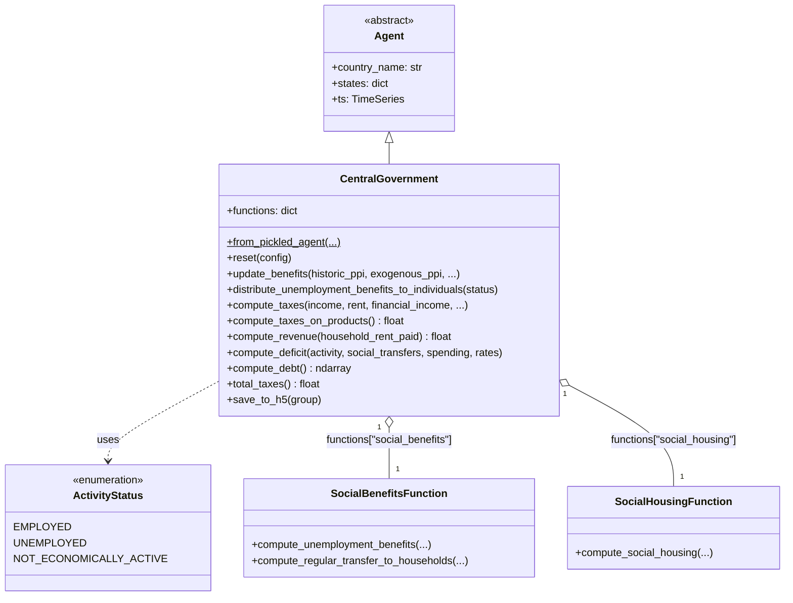
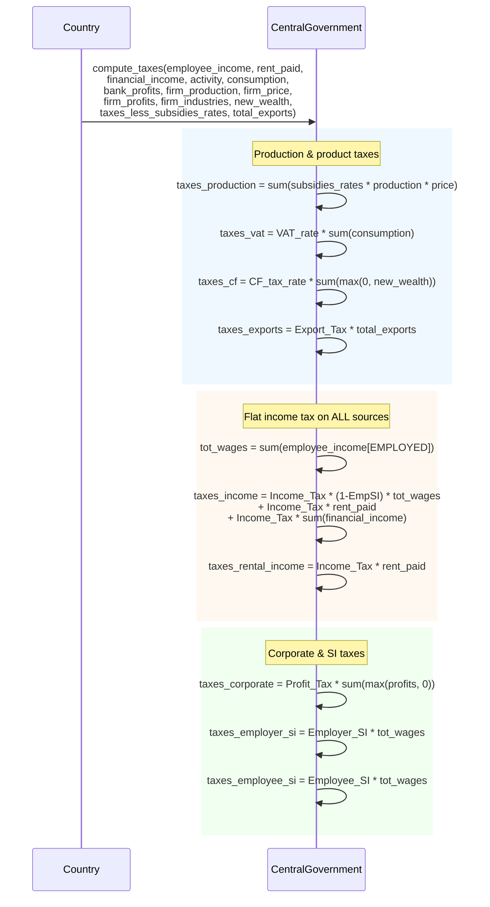
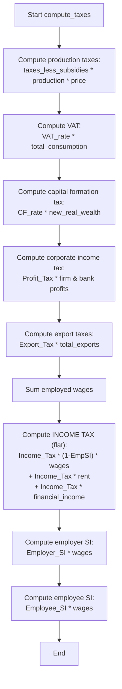
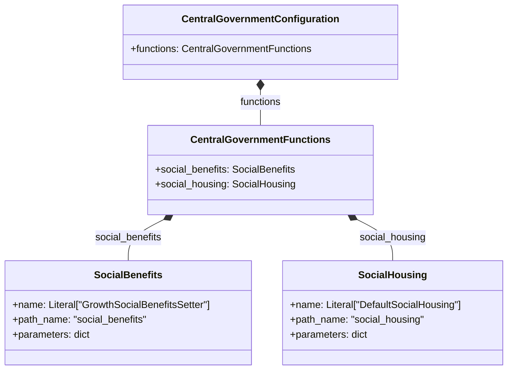

# UML: CentralGovernment Agent — Original Upstream Design

This page applies Bersini's four-diagram UML subset to the `CentralGovernment` agent
as designed in the original upstream [`uvic-sesit/macroabm-ca`](https://github.com/uvic-sesit/macroabm-ca).

**Key design characteristic**: Flat income tax only — a single scalar `Income Tax` rate
applied uniformly to wages, rental income, and financial asset income. No progressive brackets,
no CPI indexation, no basic deduction.

Reference: Bersini, H. (2012). [*UML for ABM*](https://www.jasss.org/15/1/9.html). JASSS 15(1)9.

---

## 1. Class diagram

`CentralGovernment` inherits from `Agent` and aggregates two strategy classes:
`social_benefits` and `social_housing`. It depends on `ActivityStatus`.
All taxes use flat scalar rates stored in `states`.

**`states` tax instruments (all flat scalars):**

| State | Type | Purpose |
|-------|------|---------|
| `Value-added Tax` | float | VAT rate |
| `Income Tax` | float | Flat PIT rate (applied to wages, rent, financial income) |
| `Profit Tax` | float | Corporate tax rate |
| `Employer Social Insurance Tax` | float | Employer SI contribution rate |
| `Employee Social Insurance Tax` | float | Employee SI deduction rate |
| `Capital Formation Tax` | float | Investment tax |
| `Export Tax` | float | Tax on exports |
| `Taxes Less Subsidies Rates` | ndarray | Net tax rates by sector |
| `unemployment_benefits_model` | object | Benefit computation model |
| `other_benefits_model` | object | Social transfer model |

---

## 2. Sequence diagram — `compute_taxes()` flow

Shows the tax calculation sequence within a single timestep. All income types
are taxed at the **same flat rate** (`Income Tax`).

**Key observation**: The single `Income Tax` scalar is applied identically to:
- Employee wages (post-SI deduction)
- Rental income
- Financial asset income

---

## 3. Activity diagram — tax computation procedure

---

## 4. Configuration class — upstream minimal design

> **Note**: The original upstream config has **no** `pit_brackets`, no `pit_basic_deduction`,
> and no CPI indexation fields. All income tax is flat.
