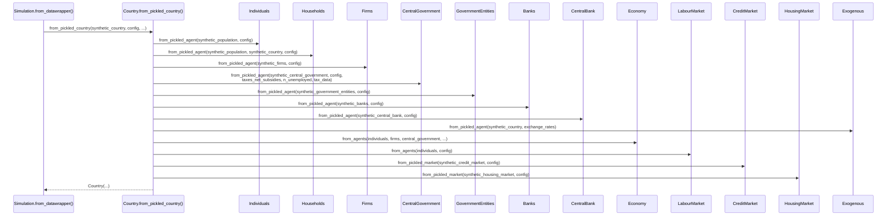
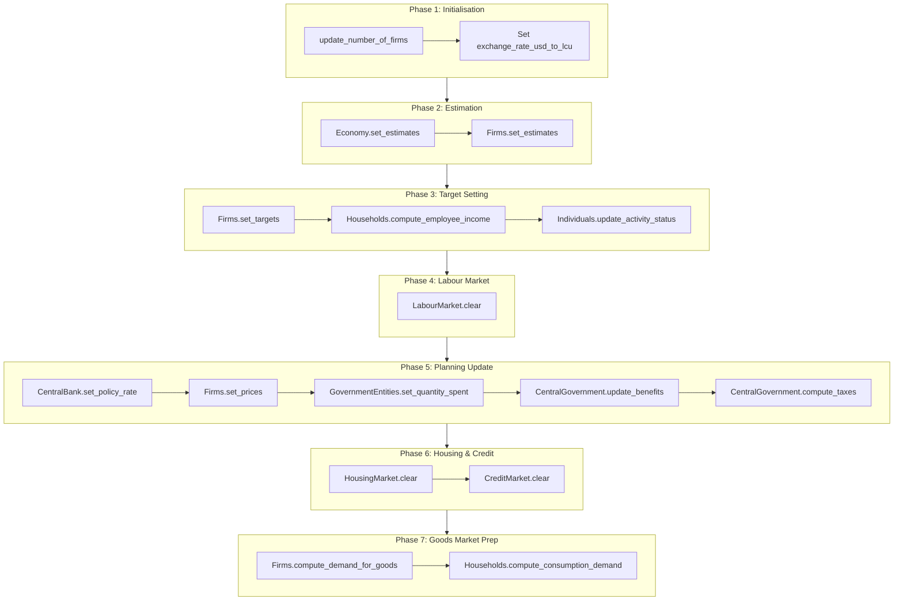

# UML: Country Orchestrator — Original Upstream Design

This page documents the `Country` class from the original upstream
[`uvic-sesit/macroabm-ca`](https://github.com/uvic-sesit/macroabm-ca) design.
`Country` is the central orchestrator that wires together all agents and markets
for a single national economy.

Reference: Bersini, H. (2012). [*UML for ABM*](https://www.jasss.org/15/1/9.html). JASSS 15(1)9.

---

## 1. Class diagram — `Country` and owned components

```mermaid
classDiagram
    direction TB

    class Country {
        +country_name: str
        +scale: int
        +individuals: Individuals
        +households: Households
        +firms: Firms
        +central_government: CentralGovernment
        +government_entities: GovernmentEntities
        +banks: Banks
        +central_bank: CentralBank
        +economy: Economy
        +labour_market: LabourMarket
        +credit_market: CreditMarket
        +housing_market: HousingMarket
        +exchange_rate_usd_to_lcu: float
        +exogenous: Exogenous
        +forecasting_window: int
        +configuration: CountryConfiguration
        +from_pickled_country(...)$
        +reset(config)
        +initialisation_phase(exchange_rate)
        +estimation_phase()
        +target_setting_phase()
        +clear_labour_market()
        +update_planning_metrics()
        +prepare_housing_market_clearing()
        +clear_housing_market()
        +process_housing_market_clearing()
        +prepare_credit_market_clearing()
        +clear_credit_market()
        +process_credit_market_clearing()
        +prepare_goods_market_clearing()
        +update_realised_metrics()
        +update_population_structure()
        +save_to_h5(f)
    }

    class Individuals {
        +country_name: str
        +states: dict
        +ts: TimeSeries
        +reset(config)
        +update_activity()
        +set_wages_income(wages)
        +set_unemployment_benefits(benefits)
    }

    class Households {
        +functions: dict
        +ts: TimeSeries
        +consumption_weights: ndarray
        +investment_weights: ndarray
        +reset(config)
        +compute_employee_income(individual_income)
        +compute_social_transfer_income(total_transfers, cpi)
        +compute_rental_income(housing_data, income_taxes)
        +compute_consumption_demand(...)
    }

    class Firms {
        +functions: dict
        +ts: FirmTimeSeries
        +n_industries: int
        +reset(config)
        +update_number_of_firms()
        +set_estimates(growth, prev_prices)
        +set_targets(...)
        +set_prices(...)
        +compute_demand_for_goods(...)
    }

    class CentralGovernment {
        +functions: dict
        +states: dict
        +pt_schedule: Optional[PITSchedule]
        +reset(config)
        +update_benefits(...)
        +distribute_unemployment_benefits(...)
        +compute_taxes(...)
        +compute_revenue(rent) float
        +compute_deficit(...)
        +compute_debt()
    }

    class GovernmentEntities {
        +ts: TimeSeries
        +reset(config)
        +set_government_quantity_spent(...)
    }

    class Banks {
        +ts: TimeSeries
        +reset(config)
    }

    class CentralBank {
        +ts: TimeSeries
        +policy_rate: float
        +reset(config)
        +set_policy_rate(...)
    }

    class Economy {
        +ts: TimeSeries
        +reset(config)
        +set_estimates(...)
    }

    class LabourMarket {
        +clear(firms, households, individuals)
    }

    class CreditMarket {
        +clear(...)
    }

    class HousingMarket {
        +clear(...)
    }

    class Exogenous {
        +national_accounts_before
        +national_accounts_during
        +reset()
    }

    Country *-- "1" Individuals
    Country *-- "1" Households
    Country *-- "1" Firms
    Country *-- "1" CentralGovernment
    Country *-- "1" GovernmentEntities
    Country *-- "1" Banks
    Country *-- "1" CentralBank
    Country *-- "1" Economy
    Country *-- "1" LabourMarket
    Country *-- "1" CreditMarket
    Country *-- "1" HousingMarket
    Country *-- "1" Exogenous
```

---

## 2. Sequence diagram — `Country.from_pickled_country()` initialisation

Shows the factory method that constructs a complete country from preprocessed data.

---

## 3. Activity diagram — `Country` simulation phases

