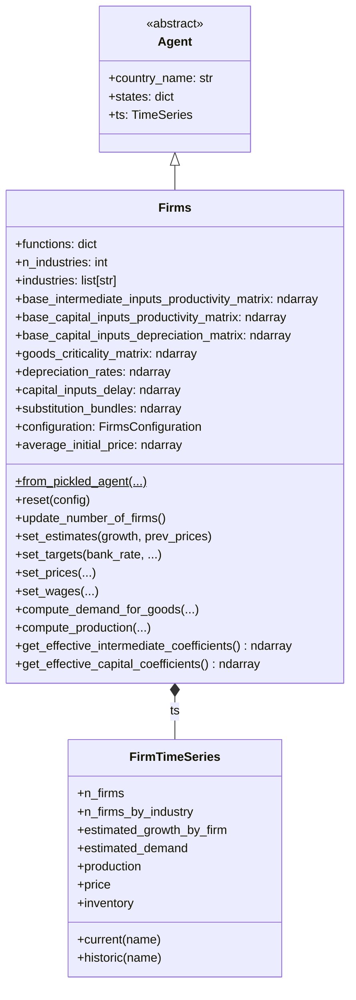
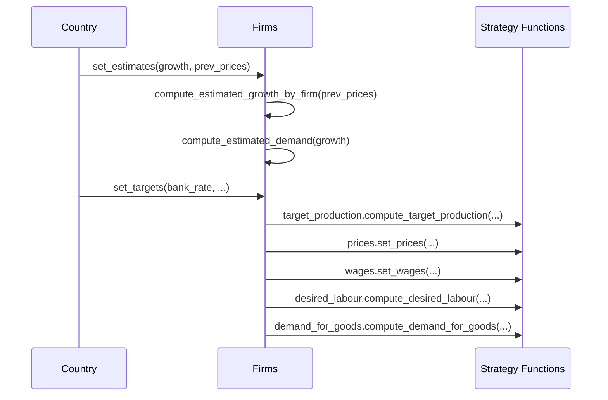

# UML: Firms Agent — Original Upstream Design

This page documents the `Firms` agent from the original upstream
[`uvic-sesit/macroabm-ca`](https://github.com/uvic-sesit/macroabm-ca) design.

`Firms` represent the productive sector — producing goods using labor,
intermediate inputs, and capital. They set prices, hire workers, manage
inventory, and make investment decisions across multiple industries.

Reference: Bersini, H. (2012). [*UML for ABM*](https://www.jasss.org/15/1/9.html). JASSS 15(1)9.

---

## 1. Class diagram

**Key `states` attributes:**

| State | Type | Purpose |
|-------|------|---------|
| `Industry` | ndarray | Industry per firm |
| `Corresponding Bank ID` | ndarray | Bank relationship |
| `Employments` | list | Employee IDs per firm |
| `is_insolvent` | ndarray | Bankruptcy flag |
| `Excess Demand` | ndarray | Unmet demand |
| `Labour Productivity by Industry` | ndarray | Productivity |
| `tfp_multiplier` | ndarray | TFP adjustment |
| `intermediate_tech_multipliers` | ndarray | Input efficiency |
| `capital_tech_multipliers` | ndarray | Capital efficiency |

---

## 2. Sequence diagram — production cycle

