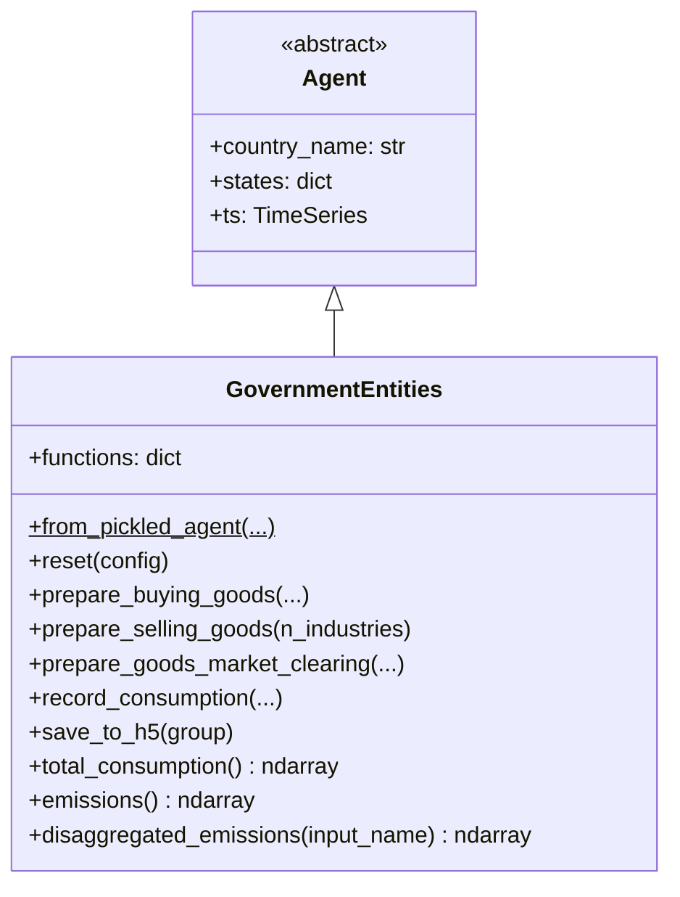
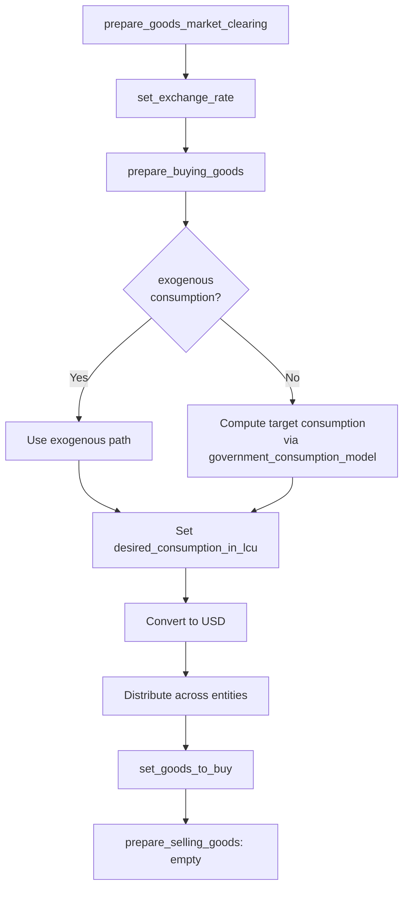

# UML: GovernmentEntities Agent — Original Upstream Design

This page documents the `GovernmentEntities` agent from the original upstream
[`uvic-sesit/macroabm-ca`](https://github.com/uvic-sesit/macroabm-ca) design.

`GovernmentEntities` represent multiple government organizations that consume
goods and services, participate in goods markets as buyers, and optionally
track emissions.

Reference: Bersini, H. (2012). [*UML for ABM*](https://www.jasss.org/15/1/9.html). JASSS 15(1)9.

---

## 1. Class diagram

**Key `states` attributes:**

| State | Type | Purpose |
|-------|------|---------|
| `government_consumption_model` | object | Consumption forecasting model |

---

## 2. Activity diagram — goods market participation

