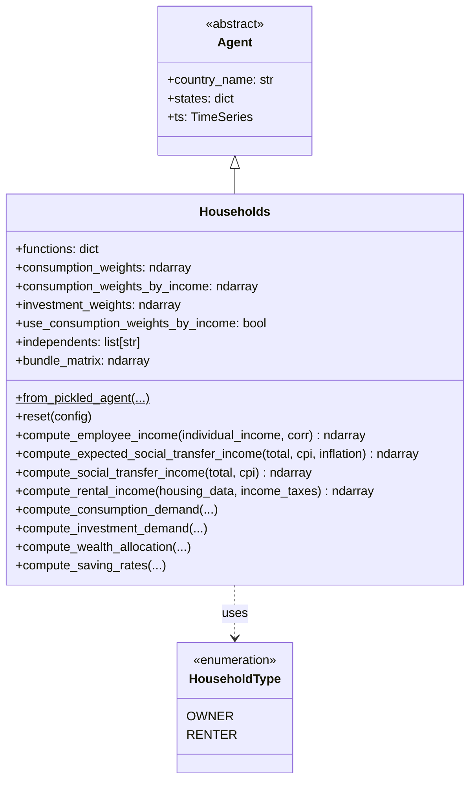
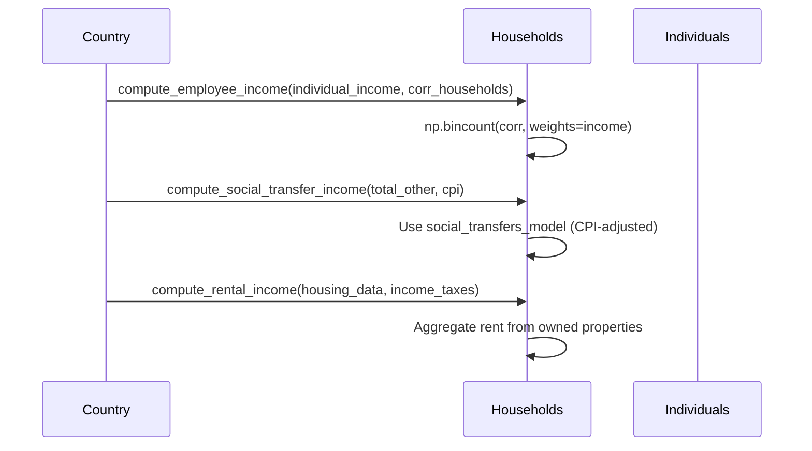

# UML: Households Agent — Original Upstream Design

This page documents the `Households` agent from the original upstream
[`uvic-sesit/macroabm-ca`](https://github.com/uvic-sesit/macroabm-ca) design.

`Households` aggregate individuals, make consumption/investment decisions,
interact with housing and credit markets, and manage wealth.

Reference: Bersini, H. (2012). [*UML for ABM*](https://www.jasss.org/15/1/9.html). JASSS 15(1)9.

---

## 1. Class diagram

**Key `states` attributes:**

| State | Type | Purpose |
|-------|------|---------|
| `Type` | ndarray | OWNER or RENTER |
| `Corresponding Bank ID` | ndarray | Bank relationship |
| `Corresponding Inhabited House ID` | ndarray | Primary residence |
| `Corresponding Property Owner` | ndarray | Landlord ID |
| `Tenure Status of the Main Residence` | ndarray | Ownership status |
| `corr_individuals` | list | Individuals per household |
| `Number of Adults` | ndarray | Adult count |
| `corr_renters` | list | Renter relationships |
| `saving_rates_model` | object | Saving behaviour model |
| `social_transfers_model` | object | Transfer allocation model |
| `wealth_distribution_model` | object | Wealth allocation model |
| `average_saving_rate` | float | Mean saving rate |
| `coefficient_fa_income` | float | Financial asset income coefficient |
| `investment_rate` | ndarray | Investment rate per household |

---

## 2. Sequence diagram — income aggregation

