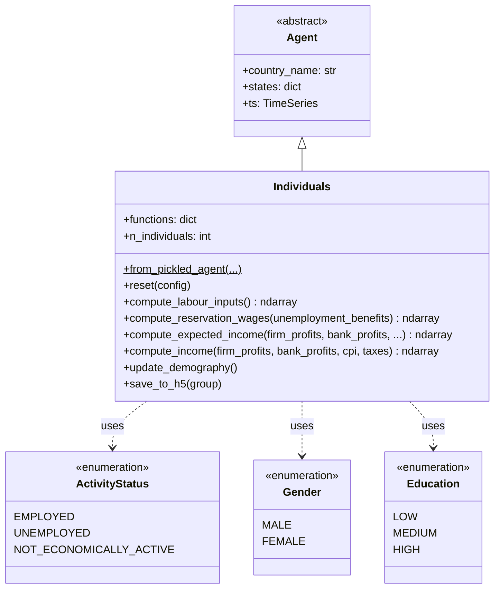
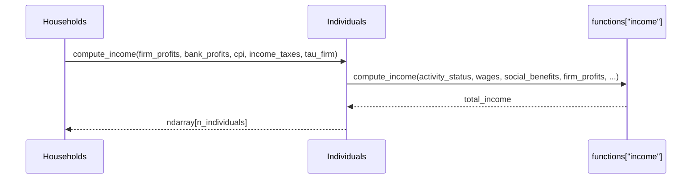
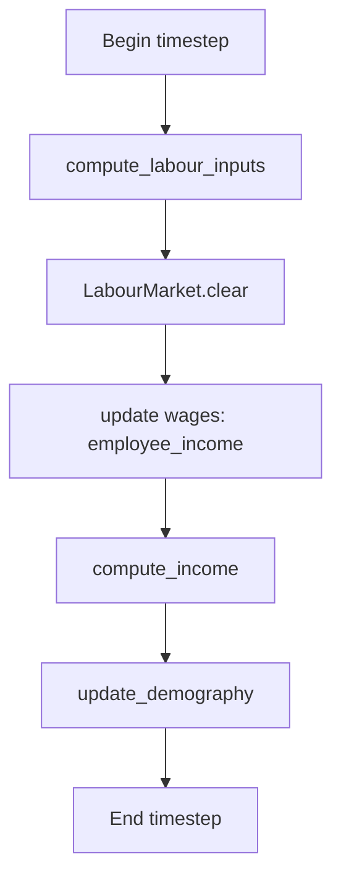

# UML: Individuals Agent — Original Upstream Design

This page documents the `Individuals` agent from the original upstream
[`uvic-sesit/macroabm-ca`](https://github.com/uvic-sesit/macroabm-ca) design.

`Individuals` represent the fundamental microeconomic units: they supply labor,
receive income, form households, and hold investments.

Reference: Bersini, H. (2012). [*UML for ABM*](https://www.jasss.org/15/1/9.html). JASSS 15(1)9.

---

## 1. Class diagram

**Key `states` attributes:**

| State | Type | Purpose |
|-------|------|---------|
| `Gender` | ndarray | Gender enum per individual |
| `Age` | ndarray | Age per individual |
| `Education` | ndarray | Education level per individual |
| `Activity Status` | ndarray | EMPLOYED/UNEMPLOYED/NOT_ECONOMICALLY_ACTIVE |
| `Employment Industry` | ndarray | Industry sector if employed |
| `Income` | ndarray | Total income per individual |
| `Employee Income` | ndarray | Wage income per individual |
| `Income from Unemployment Benefits` | ndarray | Benefit income |
| `Corresponding Household ID` | ndarray | Household mapping |
| `Corresponding Firm ID` | ndarray | Employer mapping |
| `Corresponding Invested Firm` | ndarray | Firm equity holding |
| `Corresponding Invested Bank` | ndarray | Bank equity holding |
| `Started New Job` | ndarray | Job transition flag |
| `Offered Wage of Accepted Job` | ndarray | Accepted wage |
| `Dividend Payout Ratio` | float | Dividend distribution rate |

---

## 2. Sequence diagram — income computation

---

## 3. Activity diagram — individual lifecycle in a timestep

