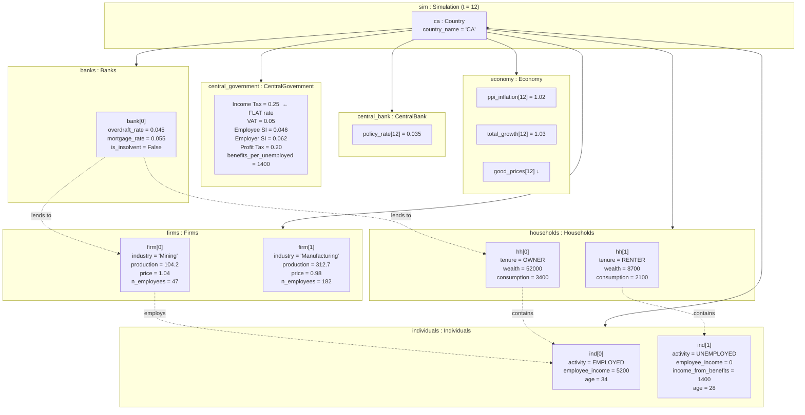

# UML: Object Diagram — Original Upstream Design

While class diagrams show the abstract structure, an **object diagram** shows
a concrete snapshot of instances at one moment in time — the "debugging
diagram."

This snapshot corresponds to tick $t = 12$ (one year into a quarterly
simulation) for `Country("CA")` under the **original flat-tax design**.

Reference: Collins et al. (2015). A Call to Arms: Standards for ABM. *JASSS* 18(3)12.

---



## Key flat-tax snapshot values at t=12

| Component | Attribute | Value | Notes |
|-----------|-----------|-------|-------|
| CentralGovernment | `Income Tax` | 0.25 | Single scalar — all income taxed at 25% |
| CentralGovernment | `VAT` | 0.05 | Flat VAT |
| CentralGovernment | `Employee SI` | 0.046 | Deducted before flat tax applied |
| CentralGovernment | `Employer SI` | 0.062 | Paid by firms |
| CentralGovernment | `Profit Tax` | 0.20 | Corporate rate |
| Individuals[0] | `employee_income` | 5200 | Gross wage; after-tax = 5200 × (1-0.046) × (1-0.25) = 3720.15 |
| Individuals[1] | `income_from_benefits` | 1400 | Unemployment benefit (not taxed) |

**Tax calculation for ind[0] (EMPLOYED):**
```
taxable_wage = 5200 × (1 - 0.046) = 4960.8
tax = 4960.8 × 0.25 = 1240.2
after_tax = 4960.8 - 1240.2 = 3720.6
```

---

## How to read this

| Notation | UML meaning | Example |
|---|---|---|
| Box with `name : Class` | An object instance | `ca : Country` |
| `attr = value` inside box | Current attribute values (snapshot) | `policy_rate[12] = 0.035` |
| Solid arrow | Composition link (strong ownership) | `Country → Economy` |
| Dashed arrow `-.->` | Runtime association / usage | `firm[0] -.-> ind[0]` |
