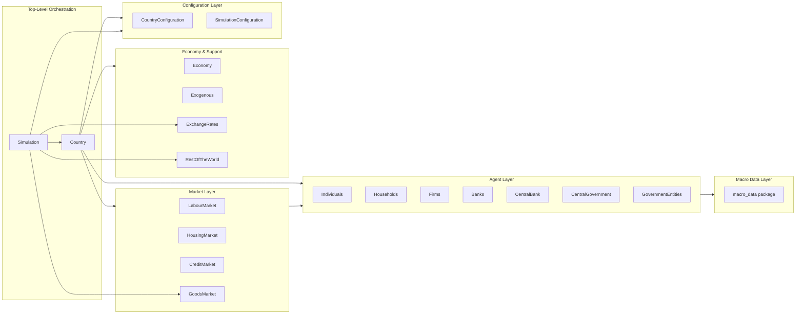

# UML: Package Diagram — Original Upstream Design

This page shows the high-level package dependencies for the original upstream
[`uvic-sesit/macroabm-ca`](https://github.com/uvic-sesit/macroabm-ca) design.

The package structure reflects a clean separation of:
- **Configuration**: Pydantic models for all agents and markets
- **Agents**: Agent implementations with behavioural strategy classes
- **Markets**: Market clearing mechanisms
- **Country/Simulation**: Top-level orchestration
- **Macro Data**: Data ingestion and preprocessing layer (in `macro_data` package)

---

## Package dependency diagram



---

## Component ownership

| Component | Owned by | Lifecycle |
|-----------|----------|-----------|
| `Individuals`, `Households`, `Firms` | `Country` | Created in `from_pickled_country()` |
| `Banks`, `CentralBank` | `Country` | Created in `from_pickled_country()` |
| `CentralGovernment`, `GovernmentEntities` | `Country` | Created in `from_pickled_country()` |
| `Economy` | `Country` | Created from agents |
| `LabourMarket`, `HousingMarket`, `CreditMarket` | `Country` | Created from agents/data |
| `GoodsMarket` | `Simulation` | Shared across all countries |
| `ExchangeRates` | `Simulation` | Shared across all countries |
| `RestOfTheWorld` | `Simulation` | Single ROW actor |
| `Exogenous` | `Country` | Per-country external data |

---

## Tax data flow (upstream design)

```
macro_data/TaxData
       │
       ▼
CentralGovernment.from_pickled_agent()
       │
       ├── states["Value-added Tax"] = tax_data.value_added_tax
       ├── states["Income Tax"]       = tax_data.income_tax  ← SINGLE flat rate
       ├── states["Profit Tax"]       = tax_data.profit_tax
       ├── states["Employer Social Insurance Tax"] = tax_data.employer_social_insurance_tax
       ├── states["Employee Social Insurance Tax"] = tax_data.employee_social_insurance_tax
       ├── states["Capital Formation Tax"] = tax_data.capital_formation_tax
       └── states["Export Tax"]       = tax_data.export_tax
```

All tax rates are **flat scalars** loaded once at initialisation and stored in `states`.
They are never modified by the configuration system. No progressive schedule, no CPI indexation.
