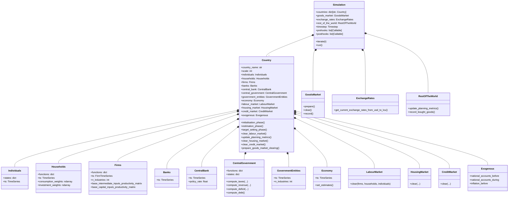
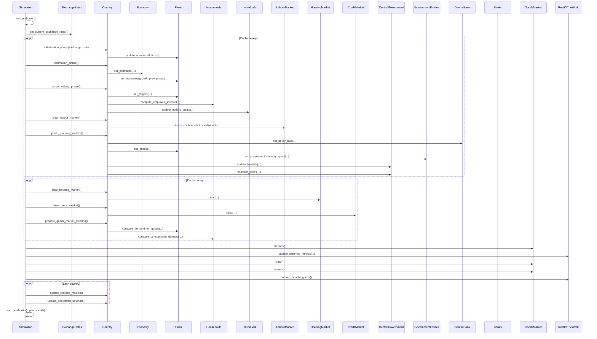
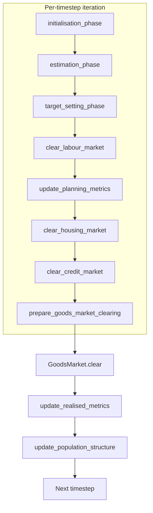
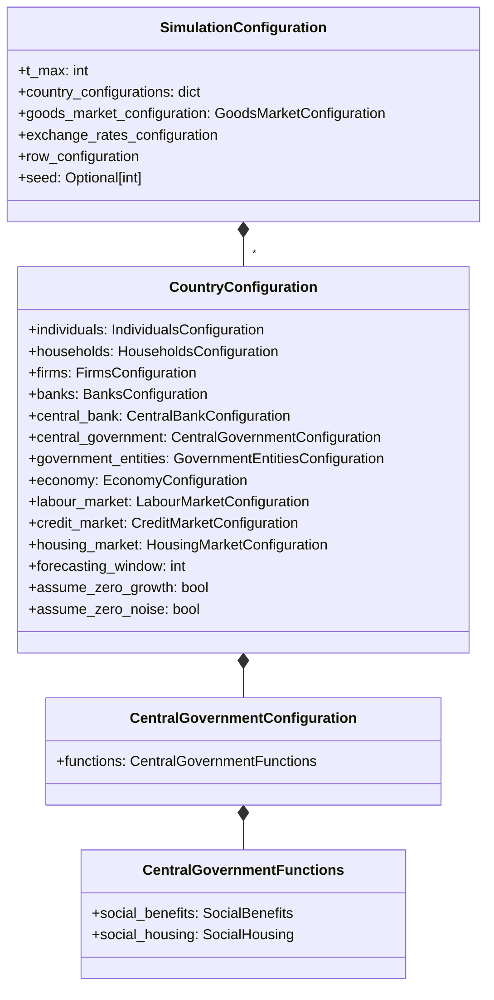

# UML: System-Wide Architecture — Original Upstream Design

This page shows the full model architecture from the original upstream
[`uvic-sesit/macroabm-ca`](https://github.com/uvic-sesit/macroabm-ca) design.
All agents, markets, and their relationships are shown across the three
cross-agent diagram types from Bersini (2012).

Reference: Bersini, H. (2012). [*UML for ABM*](https://www.jasss.org/15/1/9.html). JASSS 15(1)9.

---

## 1. Cross-agent class diagram (structural skeleton)

All agent classes, markets, and the `Country` / `Simulation` orchestrator.

---

## 2. Cross-agent sequence diagram — one timestep (`iterate`)

---

## 3. Activity diagram — `Country` phase progression

---

## 4. Configuration overview — upstream minimal design

The upstream configuration classes are minimal. `CentralGovernmentConfiguration` has
only two sub-configs (`social_benefits` and `social_housing`) with no tax-related fields
(all tax rates come from the data, not configuration).

> **Tax data flows from `TaxData` not configuration**: Tax rates (`Value-added Tax`,
> `Income Tax`, `Profit Tax`, etc.) are extracted from macro data during
> `CentralGovernment.from_pickled_agent()` and stored in `states`. They are not
> configurable via the configuration system in the upstream design.
